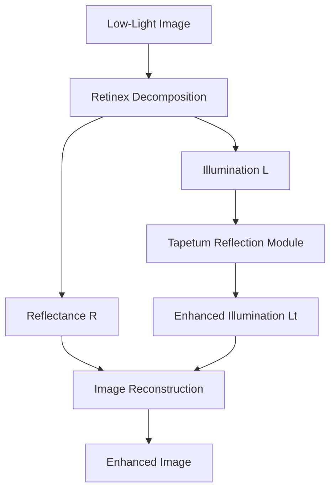
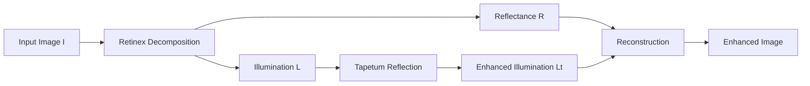
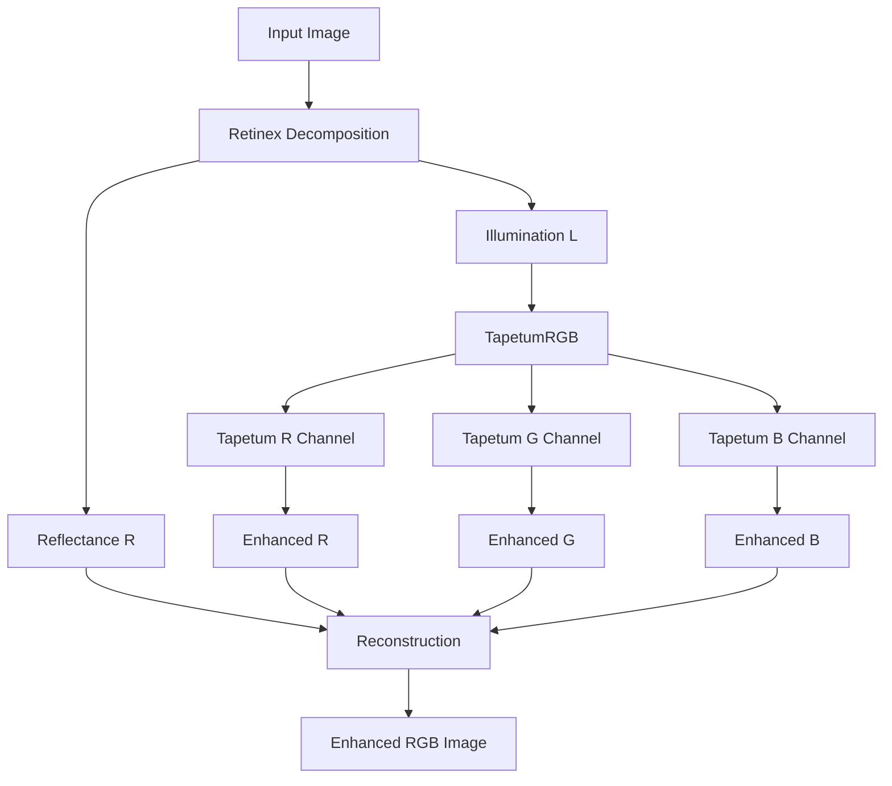
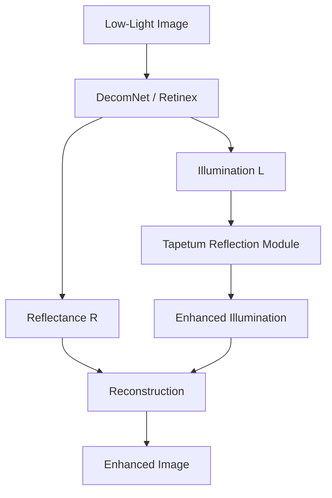
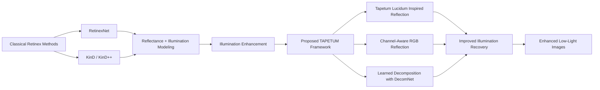
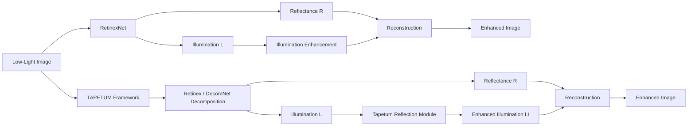

# TAPETUM
### A Bio-Inspired Retinex Framework for Low-Light Image Enhancement

<p align="center">
  
  
  
  
  
</p>

<p align="center"><b>Retinex + Tapetum Lucidum Inspired Illumination Modeling</b></p>

TAPETUM is a bio-inspired low-light image enhancement framework that combines **Retinex decomposition** with a **Tapetum Lucidum inspired reflection mechanism** observed in nocturnal animals. The goal is to improve illumination recovery in dark scenes while preserving reflectance structure, spatial detail, and color consistency.

This repository includes four main model variants:

- **RetinexTapetum**
- **RetinexTapetumRGB**
- **DecomNetRetinexTapetum**
- **DecomNetRetinexTapetumRGB**

---

## Overview

Many nocturnal animals have a reflective eye layer called **tapetum lucidum**, which reflects incoming photons back toward the retina and improves vision under low-light conditions. TAPETUM translates that biological idea into a computational framework for low-light image enhancement.

The core idea is simple:

1. Decompose the input image into **reflectance** and **illumination**.
2. Enhance the illumination using a **Tapetum-inspired reflection module**.
3. Reconstruct the final enhanced image.

---

## Framework Architecture



### Retinex-Tapetum



### Retinex-Tapetum-RGB



### Full TAPETUM Pipeline



---

## Mathematical Formulation

### Classical Retinex Model

```math
I(x)=R(x)\cdot L(x)
```

where:

- `I(x)` is the observed low-light image
- `R(x)` is the reflectance component
- `L(x)` is the illumination component

### Retinex-Tapetum

The Retinex-Tapetum variant enhances the illumination branch with a Tapetum-inspired attention map. The attention map is defined as:

```math
T(x)=\sigma(f(L(x)))\,(1-L(x))
```

where `f(·)` denotes the Tapetum attention predictor and `σ(·)` is the sigmoid activation.

The enhanced illumination is then computed by:

```math
L_t(x)=L(x)\cdotigl(1+\lambda T(x)igr)
```

and the final enhanced image is reconstructed as:

```math
I_{enh}(x)=R(x)\cdot L_t(x)
```

Substituting `L_t(x)` gives the compact form:

```math
I_{enh}(x)=R(x)\cdot L(x)\cdotigl(1+\lambda T(x)igr)
```

### Retinex-Tapetum-RGB

For channel-aware enhancement, the RGB variant introduces channel-specific modulation on top of a shared Tapetum base attention:

```math
T_{base}(x)=\sigma(f(L(x)))\odot(1-L(x))
```

```math
g_c = 1 + s	anh(lpha_c), \quad c \in \{R,G,B\}
```

```math
T^{rgb}_c(x)=T_{base,c}(x)\cdot g_c
```

The channel-wise enhanced illumination becomes:

```math
L_t^c(x)=L^c(x)\cdotigl(1+\lambda T^{rgb}_c(x)igr), \quad c \in \{R,G,B\}
```

and reconstruction is performed as:

```math
I_{enh}^c(x)=R^c(x)\cdot L_t^c(x)
```

Equivalently, the RGB output can be written in compact vector form as:

```math
I_{enh}(x)=R(x)\odot L(x)\odotigl(1+\lambda T_{rgb}(x)igr)
```

### Learned Decomposition Extension

For the DecomNet-based variants, the Retinex components are estimated by a learned decomposition network:

```math
(R,L)=DecomNet(I)
```

This learned decomposition replaces classical hand-crafted separation and improves reflectance–illumination estimation.

---

## Main Contributions

- **Bio-inspired illumination modeling** based on the tapetum lucidum mechanism.
- **Tapetum reflection module** integrated into a Retinex-based enhancement pipeline.
- **RGB channel-aware reflection control** inspired by wavelength adaptation in animals such as reindeer.
- **DecomNet-based learned decomposition** for stronger reflectance and illumination separation.
- **Extensive evaluation on LOLv2 Real Captured** using visual and quantitative comparisons.

### Contribution Diagram



### TAPETUM vs RetinexNet



---

## Repository Structure

```text
TAPETUM/
├── DecomNetRetinexTapetum/
├── DecomNetRetinexTapetumRGB/
├── LoLv2/
├── Metrics/
├── RetinexTapetumRGB/
├── datasets/
├── retinex-tapetum/
└── README.md
```

---

## Dataset

Experiments are conducted on the **LOLv2 Real Captured dataset**.

### GitHub samples
- `datasets/LoLv2/LOL-v2/Real_captured`
- Repository path: `https://github.com/muratdelen/TAPETUM/tree/main/datasets/LoLv2/LOL-v2/Real_captured`

### Google Drive dataset
- **DATASET DOWNLOAD**  
  `https://drive.google.com/drive/folders/1QO2_buG32OjDI2w3Cg1_8e5MquEww6Ix?usp=sharing`

Dataset layout:

```text
datasets/
└── LoLv2/
    └── LOL-v2/
        └── Real_captured/
            ├── Train/
            │   ├── Low/
            │   └── Normal/
            └── Test/
                ├── Low/
                └── Normal/
```

---

## Model Variants

| Model | Description |
|---|---|
| **RetinexTapetum** | Retinex decomposition with Tapetum-inspired illumination reflection |
| **RetinexTapetumRGB** | Channel-aware RGB Tapetum reflection |
| **DecomNetRetinexTapetum** | Learned decomposition + Tapetum reflection |
| **DecomNetRetinexTapetumRGB** | Learned decomposition + RGB Tapetum reflection |
| **RetinexNet** | Baseline comparison model |

---

## Visual Results

### Best-case qualitative comparisons

The repository includes curated visual comparisons in:

- GitHub: `https://github.com/muratdelen/TAPETUM/tree/main/Metrics/visuals/best_cases`
- Google Drive results: `https://drive.google.com/drive/folders/1dTq0xWTz0xJL2ngVaFqajoVVtfNE2VgY?usp=sharing`

These files include strong examples such as:

- `01_00755.png`
- `02_00756.png`
- `03_00744.png`
- `04_00751.png`
- `05_00720.png`
- `06_00741.png`
- `07_00721.png`
- `08_00748.png`
- `09_00747.png`
- `10_00750.png`

### Example visual comparisons

<p align="center">
  
</p>

<p align="center">
  
</p>

<p align="center">
  
</p>

### Per-model output folders

#### GitHub result folders
- RetinexNet: `https://github.com/muratdelen/TAPETUM/tree/main/LoLv2/RetinexNet/results/Test`
- RetinexTapetum: `https://github.com/muratdelen/TAPETUM/tree/main/LoLv2/retinex-tapetum/results/Test`
- RetinexTapetumRGB: `https://github.com/muratdelen/TAPETUM/tree/main/LoLv2/RetinexTapetumRGB/results/Test`
- DecomNetRetinexTapetum: `https://github.com/muratdelen/TAPETUM/tree/main/LoLv2/DecomNetRetinexTapetum/results/Test`
- DecomNetRetinexTapetumRGB: `https://github.com/muratdelen/TAPETUM/tree/main/LoLv2/DecomNetRetinexTapetumRGB/results/Test`

#### Google Drive resources
- **TAPETUM DOWNLOAD**  
  `https://drive.google.com/drive/folders/1EtT9abcdGIWMrzZ2zUGHB0A_gg7LMM8J?usp=sharing`
- **RETINEXNET DOWNLOAD**  
  `https://drive.google.com/drive/folders/1CKqjhcsQ5Fs8Btkn4jFoFXqCy9gZlh35?usp=sharing`
- **RESULT LOLV2 DOWNLOAD**  
  `https://drive.google.com/drive/folders/1dTq0xWTz0xJL2ngVaFqajoVVtfNE2VgY?usp=sharing`

### Qualitative observations

Across the best-case visual comparisons, the following patterns are visible:

- DecomNet-based TAPETUM variants recover darker regions more effectively.
- The RGB version generally improves color balance and spectral consistency.
- RetinexTapetum and RetinexTapetumRGB preserve the method idea, but their quantitative performance remains below the DecomNet-based variants.
- DecomNetRetinexTapetumRGB often produces the most balanced visual result in terms of brightness, detail, and color fidelity.

---

## Quantitative Results

The following average results are reported from the repository metric tables.

### Summary metrics

| Model | Matched Files | PSNR ↑ | SSIM ↑ | MAE ↓ | MSE ↓ | RMSE ↓ | LPIPS ↓ |
|---|---:|---:|---:|---:|---:|---:|---:|
| **DecomNetRetinexTapetumRGB** | 100 | **19.2938** | 0.7632 | 24.6575 | 1009.2340 | 29.8147 | 0.3983 |
| **DecomNetRetinexTapetum** | 100 | 19.2473 | **0.7734** | 24.7627 | 997.9153 | 29.7785 | 0.3669 |
| RetinexNet | 100 | 15.9504 | 0.6524 | 0.1396 | 0.0284 | 0.1639 | N/A |
| RetinexTapetumRGB | 100 | 12.4179 | 0.4208 | 62.0526 | 4733.0982 | 65.0186 | **0.3411** |
| RetinexTapetum | 100 | 11.9131 | 0.3942 | 64.8876 | 5118.1268 | 68.1592 | 0.3541 |

### Ranking summary

| Model | Rank Total | PSNR Rank | SSIM Rank | MAE Rank | MSE Rank | RMSE Rank | LPIPS Rank |
|---|---:|---:|---:|---:|---:|---:|---:|
| **DecomNetRetinexTapetum** | **13.0** | 2 | 1 | 3 | 2 | 2 | 3 |
| **RetinexNet** | **13.0** | 3 | 3 | 1 | 1 | 1 | 4 |
| DecomNetRetinexTapetumRGB | 15.0 | 1 | 2 | 2 | 3 | 3 | 4 |
| RetinexTapetumRGB | 21.0 | 4 | 4 | 4 | 4 | 4 | 1 |
| RetinexTapetum | 27.0 | 5 | 5 | 5 | 5 | 5 | 2 |

### Winner counts per image

| Model | Best PSNR | Best SSIM | Best MAE | Best MSE | Best RMSE | Best LPIPS |
|---|---:|---:|---:|---:|---:|---:|
| **DecomNetRetinexTapetum** | **39** | **69** | 0 | 0 | 0 | 44 |
| DecomNetRetinexTapetumRGB | 38 | 19 | 0 | 0 | 0 | 4 |
| RetinexNet | 15 | 3 | **100** | **100** | **100** | 0 |
| RetinexTapetumRGB | 8 | 9 | 0 | 0 | 0 | **52** |
| RetinexTapetum | 0 | 0 | 0 | 0 | 0 | 0 |

### Interpretation

- **DecomNetRetinexTapetumRGB** achieves the best average **PSNR**.
- **DecomNetRetinexTapetum** achieves the best average **SSIM** and the strongest per-image win count on both **PSNR** and **SSIM**.
- **RetinexNet** shows unusually small MAE/MSE/RMSE values compared with the other models, which suggests those error metrics may be on a different output scale or export format. They should be interpreted carefully.
- In practice, the strongest overall TAPETUM family results come from the **DecomNet-based variants**.

### Metric resources

- GitHub metric tables: `https://github.com/muratdelen/TAPETUM/tree/main/Metrics/tables`
- GitHub metric visuals: `https://github.com/muratdelen/TAPETUM/tree/main/Metrics`
- Google Drive metrics: `https://drive.google.com/drive/folders/13XOBg-1gWTgSrbhDkDteI1pIqVIdjCfE?usp=sharing`

---

## Benchmark Comparison

| Method | PSNR ↑ | SSIM ↑ | Type |
|---|---:|---:|---|
| RetinexNet | 15.95 | 0.652 | Retinex-based deep model |
| RetinexTapetum | 11.91 | 0.394 | Bio-inspired Retinex |
| RetinexTapetumRGB | 12.42 | 0.421 | Channel-aware bio-inspired Retinex |
| DecomNetRetinexTapetum | 19.25 | **0.773** | Learned Retinex + Tapetum |
| **DecomNetRetinexTapetumRGB (TAPETUM)** | **19.29** | 0.763 | Full TAPETUM model |

---

## Training and Evaluation

You can organize the repository and workflow around the following steps:

```bash
python train.py
python test.py
python evaluate.py
```

Evaluation resources in the repository:

- Comparison logs: `https://github.com/muratdelen/TAPETUM/tree/main/comparison_results`
- Result images: `https://github.com/muratdelen/TAPETUM/tree/main/LoLv2`
- Metrics: `https://github.com/muratdelen/TAPETUM/tree/main/Metrics`

---

## Downloads

### GitHub Repository
- `https://github.com/muratdelen/TAPETUM.git`

### Google Drive
- **TAPETUM DOWNLOAD**  
  `https://drive.google.com/drive/folders/1EtT9abcdGIWMrzZ2zUGHB0A_gg7LMM8J?usp=sharing`
- **DATASET DOWNLOAD**  
  `https://drive.google.com/drive/folders/1QO2_buG32OjDI2w3Cg1_8e5MquEww6Ix?usp=sharing`
- **RETINEXNET DOWNLOAD**  
  `https://drive.google.com/drive/folders/1CKqjhcsQ5Fs8Btkn4jFoFXqCy9gZlh35?usp=sharing`
- **RESULT LOLV2 DOWNLOAD**  
  `https://drive.google.com/drive/folders/1dTq0xWTz0xJL2ngVaFqajoVVtfNE2VgY?usp=sharing`
- **METRICS DOWNLOAD**  
  `https://drive.google.com/drive/folders/13XOBg-1gWTgSrbhDkDteI1pIqVIdjCfE?usp=sharing`

---

## Citation

If you use this repository in your research, cite it as:

```bibtex
@article{delen2026tapetum,
  title={Tapetum-Retinex: A Bio-Inspired Retinex Framework for Low-Light Image Enhancement},
  author={Delen, Murat},
  year={2026}
}
```

---

## Author

**Murat Delen**  
Computer Engineering  
Harran University  
GitHub: `https://github.com/muratdelen`

---

## License

This repository is provided for **research and academic purposes**.
