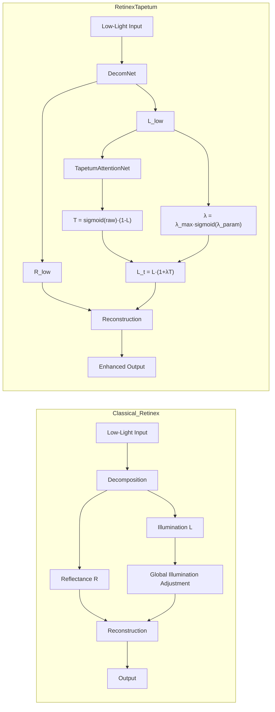
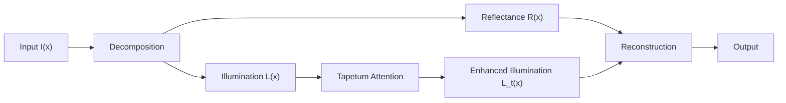

# TAPETUM: Bio-Inspired Low-Light Image Enhancement

[]
[]
[]

TAPETUM is a **bio-inspired low-light image enhancement framework**  
motivated by the **tapetum lucidum** photon reflection mechanism in nocturnal animals.

---

## 🚀 Overview

Low-light image enhancement (LLIE) is fundamentally an **illumination recovery problem**.

Classical Retinex:
I(x) = R(x) · L(x)

TAPETUM:
L_t(x) = L(x)(1 + λT(x))  
I_enh(x) = R(x) · L_t(x)

👉 Key difference:

- Retinex → passive illumination correction  
- TAPETUM → **active and adaptive illumination amplification**

---

## 🧠 Core Idea

In biological systems (e.g., cats, deer):

- Light is reflected back through the retina  
- The same photons are reused  
- Visibility improves in low-light conditions  

Simplified model:
I_eff = I + rI

TAPETUM formulation:
T(x) = sigmoid(f(L(x))) · (1 - L(x))  
L_t(x) = L(x)(1 + λT(x))

---

## ⚙️ Pipeline Comparison

---

## 🧩 Architecture

---

## 📊 Results (LOLv2 Real)

| Model | PSNR ↑ | SSIM ↑ |
|------|------:|------:|
| RetinexNet | 15.95 | 0.652 |
| **RetinexTapetum** | **19.24** | **0.773** |

---

## 📁 Dataset

LOLv2 Real Captured:

datasets/LoLv2/LOL-v2/Real_captured/

---

## ⚡ Quick Start

python run_all_tapetum_models_colab.py

---

## 📖 Citation

@article{delen2026tapetum,
  title={Tapetum-Retinex: A Bio-Inspired Low-Light Image Enhancement},
  author={Delen, Murat},
  year={2026}
}

---

## 👤 Author

Murat Delen  
Harran University  
Computer Engineering
