# TAPETUM: Bio-Inspired Low-Light Image Enhancement

[]
[]
[]
[]

Bio-inspired low-light image enhancement framework inspired by **tapetum lucidum** photon reflection mechanisms in nocturnal animals.

---

## Table of Contents

- Project Highlights
- TAPETUM Architecture
- Overview
- Framework Architecture
- Mathematical Formulation
- Biological Inspiration
- Biological Vision → TAPETUM Algorithm
- Biological Interpretation of Metrics
- Quantitative Results
- Related Work
- Colab Quick Start
- Training & Evaluation
- Citation

---

### A Bio-Inspired Retinex Framework for Low-Light Image Enhancement

<p align="center">
  
  
  
  
  
</p>

<p align="center"><b>Retinex + Tapetum Lucidum Inspired Illumination Modeling</b></p>

TAPETUM is a bio-inspired low-light image enhancement framework that combines **Retinex decomposition** with a **Tapetum Lucidum inspired reflection mechanism** observed in nocturnal animals. The goal is to improve illumination recovery in dark scenes while preserving reflectance structure, spatial detail, and color consistency.

This repository includes four main model variants:

- **RetinexTapetum**
- **RetinexTapetumRGB**
- **DecomNetRetinexTapetum**
- **DecomNetRetinexTapetumRGB**

---


---


---

## Project Highlights

The TAPETUM framework introduces a biologically inspired mechanism for low‑light image enhancement.  
Key contributions of the project are summarized below.

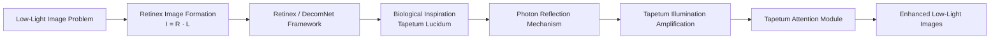

### Key Contributions

- **Bio‑Inspired Illumination Amplification**  
  Introduces a computational interpretation of the *tapetum lucidum* mechanism.

- **Tapetum Attention Module**  
  Enhances illumination using a learnable attention mechanism.

- **RGB Spectral Tapetum Variant**  
  Inspired by reindeer seasonal spectral adaptation.

- **Compatibility with Retinex Frameworks**  
  Works with both classical Retinex decomposition and learned decomposition networks.

- **Improved Quantitative Performance**  
  Demonstrates strong performance on LOLv2 dataset using PSNR and SSIM metrics.


---

## Method Comparison: Retinex vs TAPETUM vs TAPETUM RGB

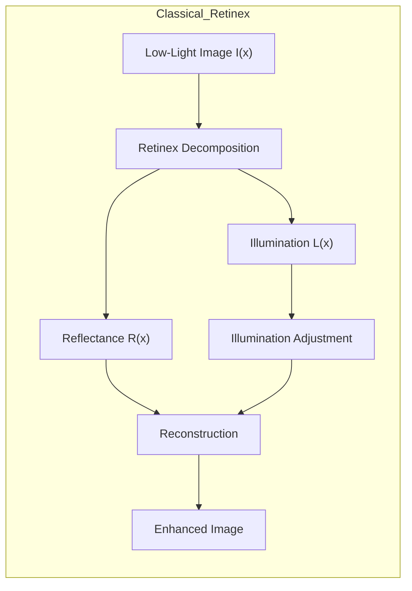

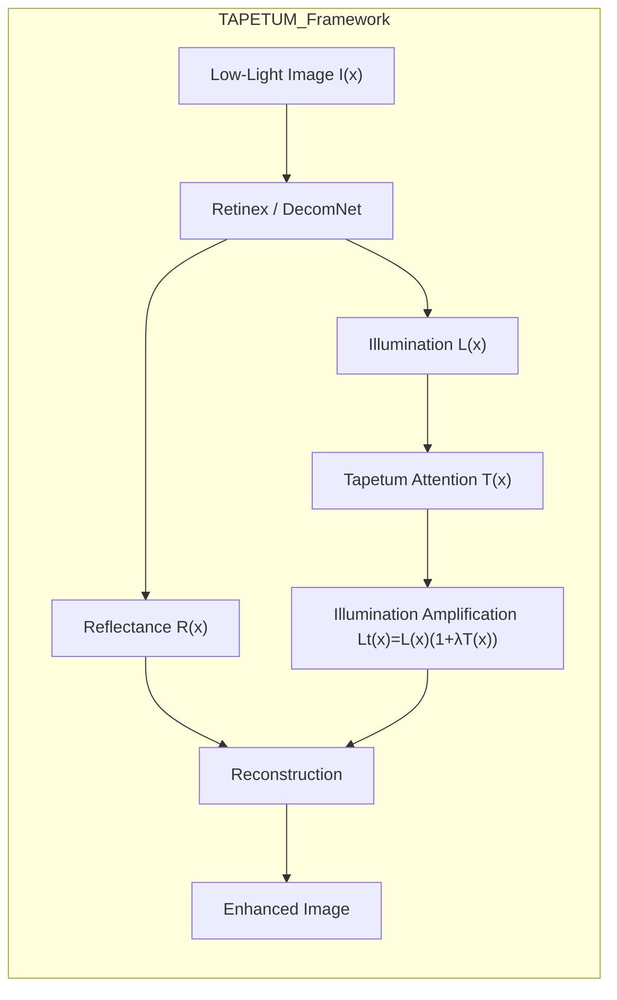

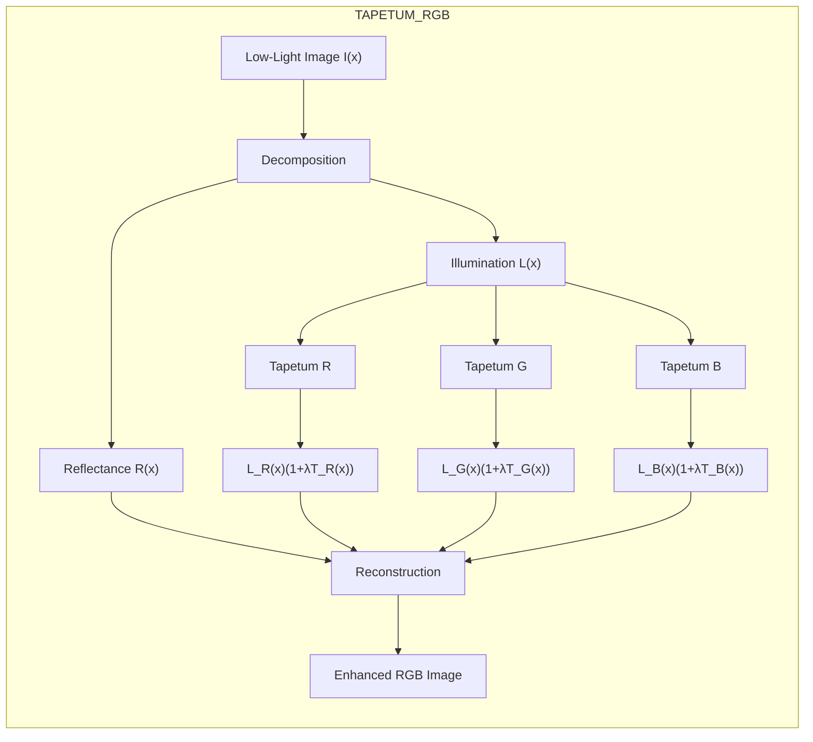


## TAPETUM Complete Architecture

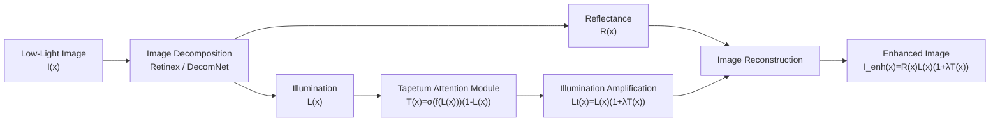

### TAPETUM RGB Architecture

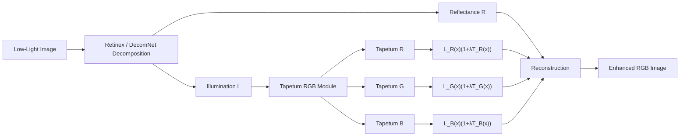


## Overview

Many nocturnal animals have a reflective eye layer called **tapetum lucidum**, which reflects incoming photons back toward the retina and improves vision under low-light conditions. TAPETUM translates that biological idea into a computational framework for low-light image enhancement.

The core idea is simple:

1. Decompose the input image into **reflectance** and **illumination**.
2. Enhance the illumination using a **Tapetum-inspired reflection module**.
3. Reconstruct the final enhanced image.

---

## Framework Architecture

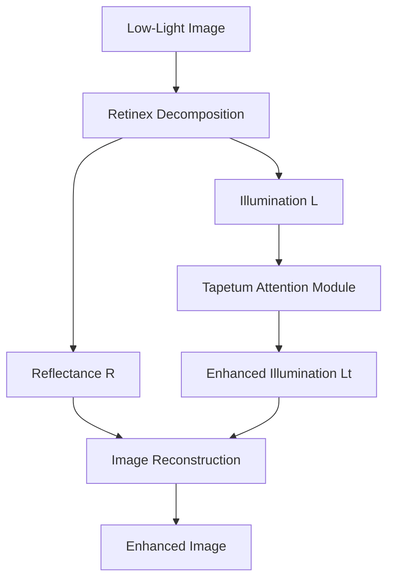

### Retinex-Tapetum

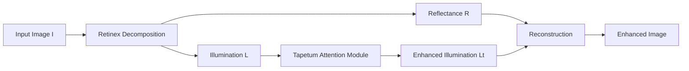

### Retinex-Tapetum-RGB

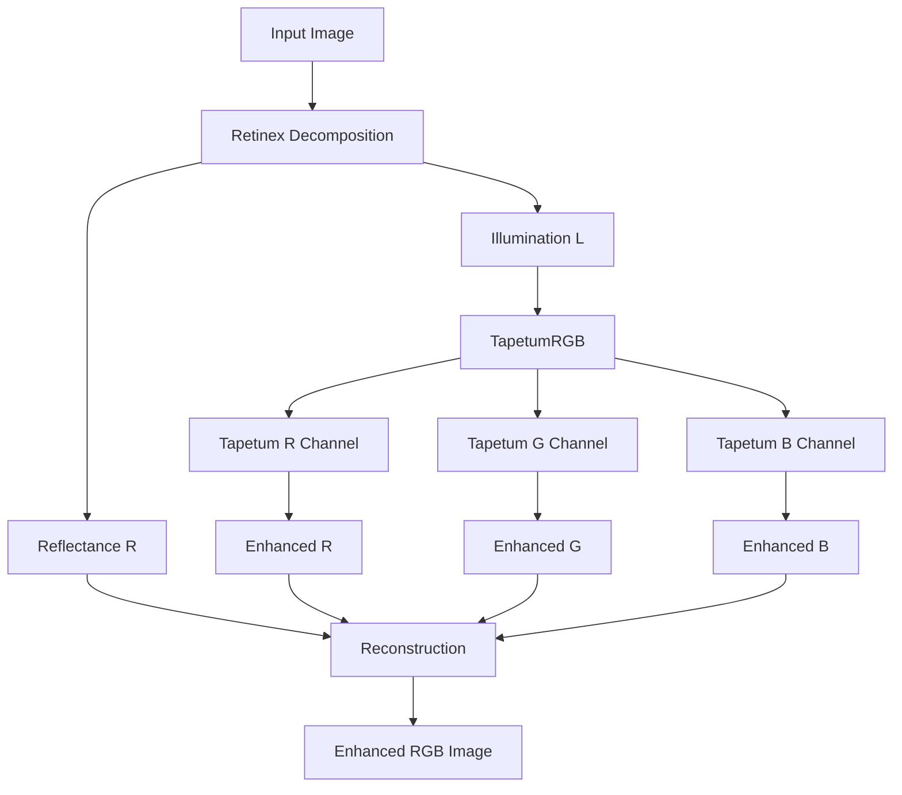

### Full TAPETUM Pipeline

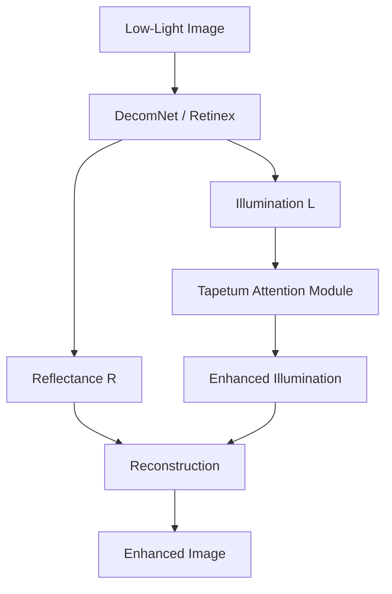

---


## Complete TAPETUM Framework

The TAPETUM framework integrates Retinex decomposition, Tapetum-inspired illumination enhancement, and optional RGB channel-aware modulation.

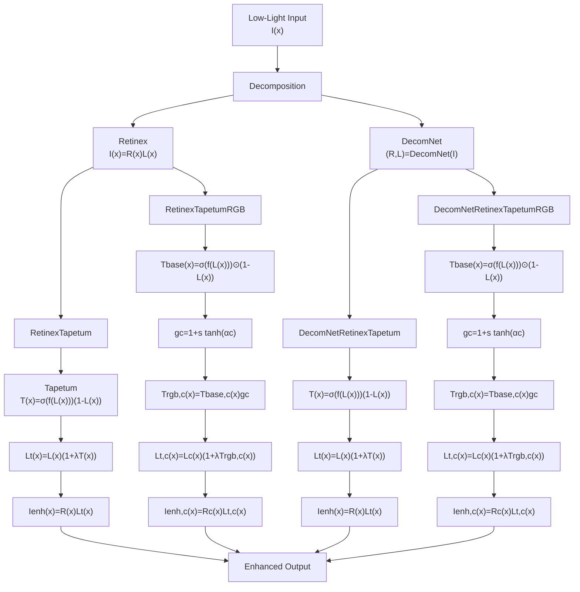

### Model Family Overview

| Model | Decomposition | Tapetum | RGB Modulation |
|---|---|---|---|
| RetinexTapetum | Retinex | ✓ | ✗ |
| RetinexTapetumRGB | Retinex | ✓ | ✓ |
| DecomNetRetinexTapetum | DecomNet | ✓ | ✗ |
| DecomNetRetinexTapetumRGB | DecomNet | ✓ | ✓ |

### Core TAPETUM Equation

```math
I_{enh}(x)=R(x)L(x)(1+\lambda T(x))
```


## Mathematical Formulation

### Classical Retinex Model

```math
I(x) = R(x)\cdot L(x)
```

where

- I(x) is the observed low-light image
- R(x) is the reflectance component
- L(x) is the illumination component

---

### Retinex-Tapetum

Tapetum attention map:

```math
T(x) = \sigma(f(L(x)))\,(1-L(x))
```

Enhanced illumination:

```math
L_t(x) = L(x)\,(1+\lambda T(x))
```

Reconstruction:

```math
I_{enh}(x) = R(x)\cdot L_t(x)
```

Compact formulation:

```math
I_{enh}(x) = R(x)\cdot L(x)\,(1+\lambda T(x))
```

---

### Retinex-Tapetum-RGB

Base attention:

```math
T_{base}(x) = \sigma(f(L(x)))\odot (1-L(x))
```

Channel modulation:

```math
g_c = 1 + s\tanh(\alpha_c), \quad c \in \{R,G,B\}
```

Channel-specific Tapetum map:

```math
T^{rgb}_c(x) = T_{base,c}(x)\cdot g_c
```

Enhanced illumination per channel:

```math
L_t^c(x) = L^c(x)\,(1+\lambda T^{rgb}_c(x)), \quad c \in \{R,G,B\}
```

Reconstruction:

```math
I_{enh}^c(x) = R^c(x)\cdot L_t^c(x)
```

Vector form:

```math
I_{enh}(x) = R(x)\odot L(x)\odot (1+\lambda T_{rgb}(x))
```


## Main Contributions

- **Bio-inspired illumination modeling** based on the tapetum lucidum mechanism.
- **Tapetum reflection module** integrated into a Retinex-based enhancement pipeline.
- **RGB channel-aware reflection control** inspired by wavelength adaptation in animals such as reindeer.
- **DecomNet-based learned decomposition** for stronger reflectance and illumination separation.
- **Extensive evaluation on LOLv2 Real Captured** using visual and quantitative comparisons.

### Contribution Diagram

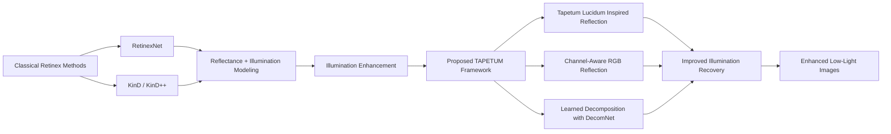

### TAPETUM vs RetinexNet

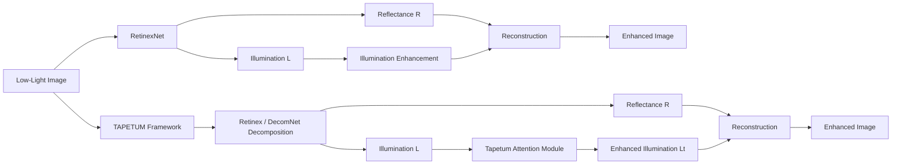

---

## Repository Structure

```text
TAPETUM/
├── DecomNetRetinexTapetum/
├── DecomNetRetinexTapetumRGB/
├── LoLv2/
├── Metrics/
├── RetinexTapetumRGB/
├── datasets/
├── retinex-tapetum/
└── README.md
```

---

## Dataset

Experiments are conducted on the **LOLv2 Real Captured dataset**.

### GitHub samples
- `datasets/LoLv2/LOL-v2/Real_captured`
- Repository path: `https://github.com/muratdelen/TAPETUM/tree/main/datasets/LoLv2/LOL-v2/Real_captured`

### Google Drive dataset
- **DATASET DOWNLOAD**  
  `https://drive.google.com/drive/folders/1QO2_buG32OjDI2w3Cg1_8e5MquEww6Ix?usp=sharing`

Dataset layout:

```text
datasets/
└── LoLv2/
    └── LOL-v2/
        └── Real_captured/
            ├── Train/
            │   ├── Low/
            │   └── Normal/
            └── Test/
                ├── Low/
                └── Normal/
```

---

## Model Variants

| Model | Description |
|---|---|
| **RetinexTapetum** | Retinex decomposition with Tapetum-inspired illumination reflection |
| **RetinexTapetumRGB** | Channel-aware RGB Tapetum reflection |
| **DecomNetRetinexTapetum** | Learned decomposition + Tapetum reflection |
| **DecomNetRetinexTapetumRGB** | Learned decomposition + RGB Tapetum reflection |
| **RetinexNet** | Baseline comparison model |

---

## Visual Results

### Best-case qualitative comparisons

The repository includes curated visual comparisons in:

- GitHub: `https://github.com/muratdelen/TAPETUM/tree/main/Metrics/visuals/best_cases`
- Google Drive results: `https://drive.google.com/drive/folders/1dTq0xWTz0xJL2ngVaFqajoVVtfNE2VgY?usp=sharing`

These files include strong examples such as:

- `01_00755.png`
- `02_00756.png`
- `03_00744.png`
- `04_00751.png`
- `05_00720.png`
- `06_00741.png`
- `07_00721.png`
- `08_00748.png`
- `09_00747.png`
- `10_00750.png`

### Example visual comparisons

<p align="center">
  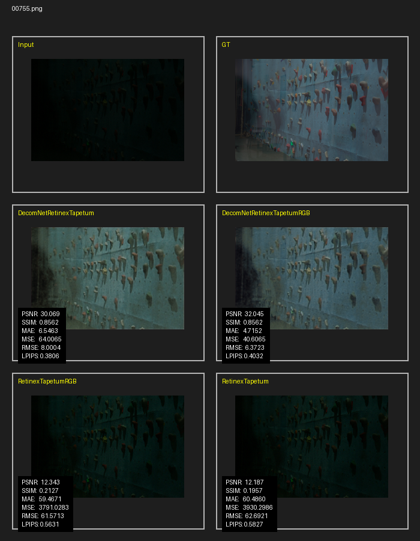
</p>

<p align="center">
  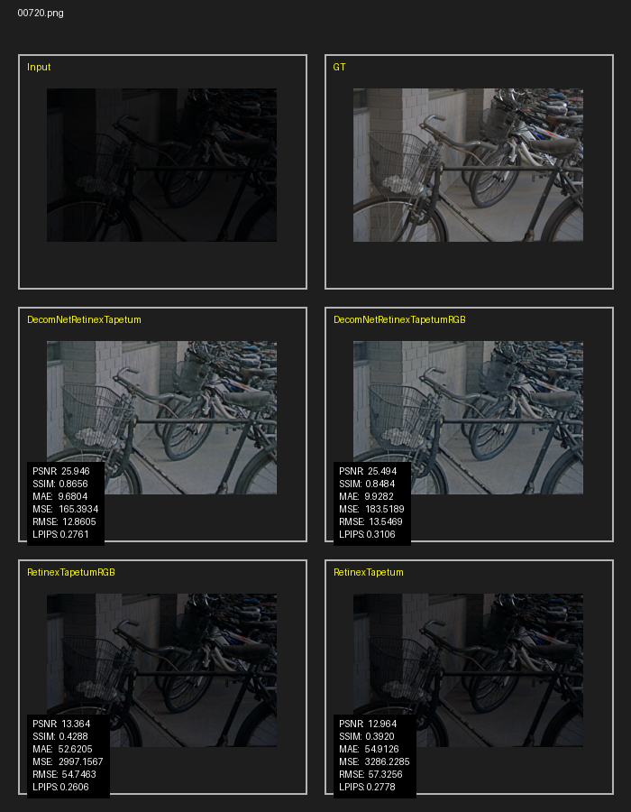
</p>

<p align="center">
  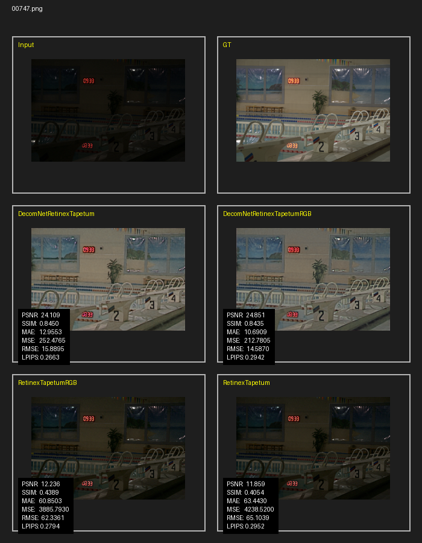
</p>

### Per-model output folders

#### GitHub result folders
- RetinexNet: `https://github.com/muratdelen/TAPETUM/tree/main/LoLv2/RetinexNet/results/Test`
- RetinexTapetum: `https://github.com/muratdelen/TAPETUM/tree/main/LoLv2/retinex-tapetum/results/Test`
- RetinexTapetumRGB: `https://github.com/muratdelen/TAPETUM/tree/main/LoLv2/RetinexTapetumRGB/results/Test`
- DecomNetRetinexTapetum: `https://github.com/muratdelen/TAPETUM/tree/main/LoLv2/DecomNetRetinexTapetum/results/Test`
- DecomNetRetinexTapetumRGB: `https://github.com/muratdelen/TAPETUM/tree/main/LoLv2/DecomNetRetinexTapetumRGB/results/Test`

#### Google Drive resources
- **TAPETUM DOWNLOAD**  
  `https://drive.google.com/drive/folders/1EtT9abcdGIWMrzZ2zUGHB0A_gg7LMM8J?usp=sharing`
- **RETINEXNET DOWNLOAD**  
  `https://drive.google.com/drive/folders/1CKqjhcsQ5Fs8Btkn4jFoFXqCy9gZlh35?usp=sharing`
- **RESULT LOLV2 DOWNLOAD**  
  `https://drive.google.com/drive/folders/1dTq0xWTz0xJL2ngVaFqajoVVtfNE2VgY?usp=sharing`

### Qualitative observations

Across the best-case visual comparisons, the following patterns are visible:

- DecomNet-based TAPETUM variants recover darker regions more effectively.
- The RGB version generally improves color balance and spectral consistency.
- RetinexTapetum and RetinexTapetumRGB preserve the method idea, but their quantitative performance remains below the DecomNet-based variants.
- DecomNetRetinexTapetumRGB often produces the most balanced visual result in terms of brightness, detail, and color fidelity.

---


---

## Method Overview

The TAPETUM framework extends classical Retinex-based low-light enhancement by introducing a biologically inspired illumination reflection mechanism. The model family integrates:

- Retinex-based illumination modeling
- Tapetum-inspired reflection attention
- Optional RGB channel-aware modulation
- Optional learned decomposition using DecomNet

### Method Flow

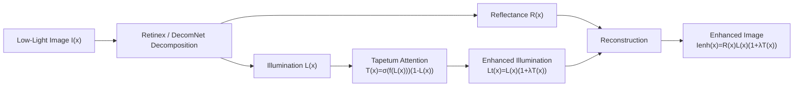

---


### Paper-Style Method Figure

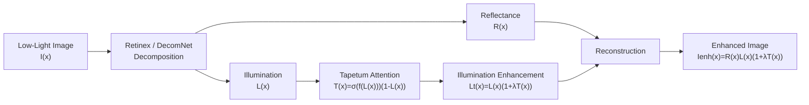

### Model Variants Overview

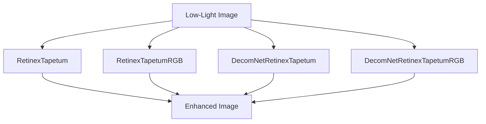

### Model Family Table

| Model | Decomposition | Tapetum Attention | RGB Modulation |
|---|---|---|---|
| RetinexTapetum | Retinex | ✓ | ✗ |
| RetinexTapetumRGB | Retinex | ✓ | ✓ |
| DecomNetRetinexTapetum | DecomNet | ✓ | ✗ |
| DecomNetRetinexTapetumRGB | DecomNet | ✓ | ✓ |

### TAPETUM Core Equations

```math
I_{enh}(x)=R(x)L(x)(1+\lambda T(x))
```

```math
I_{enh}(x)=R(x)\odot L(x)\odot(1+\lambda T_{rgb}(x))
```

### Comparison Visualization Structure

```markdown
### Comparison Visualization Structure

| Low-Light Input | Ground Truth | RetinexNet | RetinexTapetum | TapetumRGB | DecomNetTapetum | DecomNetTapetumRGB |
|------|------|------|------|------|------|------|
|  |  |  |  |  |  |  |
```


## Training Pipeline

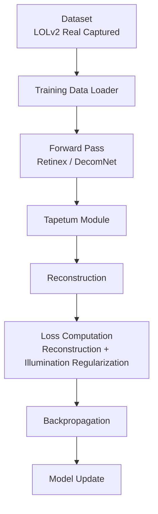

---

## Results Gallery

Example qualitative results comparing Retinex-based methods and the TAPETUM family.

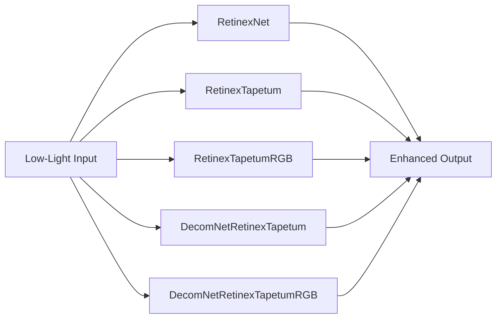

These comparisons illustrate the improvement in illumination recovery and color consistency achieved by the TAPETUM framework.


## Quantitative Results

The following average results are reported from the repository metric tables.

### Summary metrics

| Model | Matched Files | PSNR ↑ | SSIM ↑ | MAE ↓ | MSE ↓ | RMSE ↓ | LPIPS ↓ |
|---|---:|---:|---:|---:|---:|---:|---:|
| **DecomNetRetinexTapetumRGB** | 100 | **19.2938** | 0.7632 | 24.6575 | 1009.2340 | 29.8147 | 0.3983 |
| **DecomNetRetinexTapetum** | 100 | 19.2473 | **0.7734** | 24.7627 | 997.9153 | 29.7785 | 0.3669 |
| RetinexNet | 100 | 15.9504 | 0.6524 | 0.1396 | 0.0284 | 0.1639 | N/A |
| RetinexTapetumRGB | 100 | 12.4179 | 0.4208 | 62.0526 | 4733.0982 | 65.0186 | **0.3411** |
| RetinexTapetum | 100 | 11.9131 | 0.3942 | 64.8876 | 5118.1268 | 68.1592 | 0.3541 |

### Ranking summary

| Model | Rank Total | PSNR Rank | SSIM Rank | MAE Rank | MSE Rank | RMSE Rank | LPIPS Rank |
|---|---:|---:|---:|---:|---:|---:|---:|
| **DecomNetRetinexTapetum** | **13.0** | 2 | 1 | 3 | 2 | 2 | 3 |
| **RetinexNet** | **13.0** | 3 | 3 | 1 | 1 | 1 | 4 |
| DecomNetRetinexTapetumRGB | 15.0 | 1 | 2 | 2 | 3 | 3 | 4 |
| RetinexTapetumRGB | 21.0 | 4 | 4 | 4 | 4 | 4 | 1 |
| RetinexTapetum | 27.0 | 5 | 5 | 5 | 5 | 5 | 2 |

### Winner counts per image

| Model | Best PSNR | Best SSIM | Best MAE | Best MSE | Best RMSE | Best LPIPS |
|---|---:|---:|---:|---:|---:|---:|
| **DecomNetRetinexTapetum** | **39** | **69** | 0 | 0 | 0 | 44 |
| DecomNetRetinexTapetumRGB | 38 | 19 | 0 | 0 | 0 | 4 |
| RetinexNet | 15 | 3 | **100** | **100** | **100** | 0 |
| RetinexTapetumRGB | 8 | 9 | 0 | 0 | 0 | **52** |
| RetinexTapetum | 0 | 0 | 0 | 0 | 0 | 0 |

### Interpretation

- **DecomNetRetinexTapetumRGB** achieves the best average **PSNR**.
- **DecomNetRetinexTapetum** achieves the best average **SSIM** and the strongest per-image win count on both **PSNR** and **SSIM**.
- **RetinexNet** shows unusually small MAE/MSE/RMSE values compared with the other models, which suggests those error metrics may be on a different output scale or export format. They should be interpreted carefully.
- In practice, the strongest overall TAPETUM family results come from the **DecomNet-based variants**.

### Metric resources

- GitHub metric tables: `https://github.com/muratdelen/TAPETUM/tree/main/Metrics/tables`
- GitHub metric visuals: `https://github.com/muratdelen/TAPETUM/tree/main/Metrics`
- Google Drive metrics: `https://drive.google.com/drive/folders/13XOBg-1gWTgSrbhDkDteI1pIqVIdjCfE?usp=sharing`

---

## Benchmark Comparison

| Method | PSNR ↑ | SSIM ↑ | Type |
|---|---:|---:|---|
| RetinexNet | 15.95 | 0.652 | Retinex-based deep model |
| RetinexTapetum | 11.91 | 0.394 | Bio-inspired Retinex |
| RetinexTapetumRGB | 12.42 | 0.421 | Channel-aware bio-inspired Retinex |
| DecomNetRetinexTapetum | 19.25 | **0.773** | Learned Retinex + Tapetum |
| **DecomNetRetinexTapetumRGB (TAPETUM)** | **19.29** | 0.763 | Full TAPETUM model |

---


---


---


---

## Biological Inspiration of TAPETUM

---

## Biological Vision → TAPETUM Algorithm

The TAPETUM framework is inspired by biological photon reflection mechanisms observed in nocturnal animals.  
The following conceptual diagram shows how the biological idea translates into the computational model.

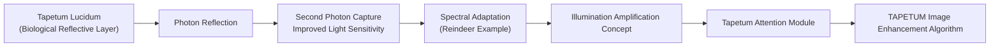


The TAPETUM framework is inspired by biological vision mechanisms found in nocturnal animals. Many animals that are active in low-light environments possess a reflective layer in their eyes called the **tapetum lucidum**. This structure reflects incoming light back through the retina, allowing photoreceptors to capture photons that were not absorbed during the first pass.

This optical feedback mechanism effectively increases the usable illumination under dark conditions.

### Tapetum Reflection Concept

In a simplified model, the effective light reaching the retina can be approximated as:

```math
I_{effective} = I + rI
```

where:

- \(I\) represents the incoming light
- \(rI\) represents the reflected component from the tapetum layer

This results in increased perceived brightness but may introduce slight spatial diffusion due to scattering.

### Inspiration for the TAPETUM Algorithm

The TAPETUM model translates this concept into an image enhancement pipeline:

1. **Retinex decomposition** separates reflectance and illumination.
2. **Tapetum attention** amplifies illumination in darker regions.
3. **Reconstruction** produces the enhanced image with improved visibility.

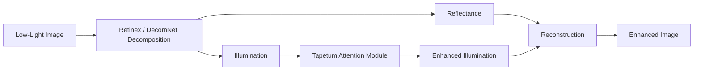

### Biological Motivation

The design philosophy behind TAPETUM follows a similar trade-off observed in biological systems:

- increased photon capture improves **brightness perception**
- spectral or reflective amplification may slightly affect **structural fidelity**

This balance between **illumination recovery** and **structural preservation** is reflected in the performance characteristics of the TAPETUM model variants.


## Biological Interpretation of Metric Differences

The performance differences between **DecomNetRetinexTapetumRGB** and **DecomNetRetinexTapetum** can be interpreted through the biological inspiration behind the TAPETUM framework.

Many nocturnal animals possess a reflective retinal layer known as **tapetum lucidum**. This structure reflects incoming photons back toward the photoreceptors, effectively increasing the amount of captured light under low-illumination conditions.

In simplified form, the effective photon energy reaching the retina can be described as:

```math
I_{effective} = I + rI
```

where \(r\) represents the reflected light component.

This mechanism improves brightness perception but may introduce slight structural distortions due to scattering from the reflective surface.

### Reindeer Spectral Adaptation

Certain animals such as **reindeer** exhibit seasonal changes in the spectral behavior of the tapetum lucidum.

During winter:

- the tapetum shifts toward **blue wavelength reflection**
- shorter wavelengths scatter more strongly
- more photons are captured in dim environments

As a result:

- **perceived brightness increases**
- but **visual structure may become slightly degraded**

This biological trade-off between **light sensitivity** and **structural fidelity** is analogous to the behavior observed in the TAPETUM models.

### Interpretation of TAPETUM Metrics

In the experimental results:

| Model | PSNR | SSIM |
|---|---|---|
| DecomNetRetinexTapetumRGB | Higher | Slightly lower |
| DecomNetRetinexTapetum | Slightly lower | Higher |

#### DecomNetRetinexTapetumRGB

The RGB variant enhances illumination independently across color channels:

```math
L_t^c(x) = L^c(x)(1+\lambda T^{rgb}_c(x))
```

This stronger spectral illumination amplification can increase pixel-level reconstruction accuracy, which leads to:

- higher **PSNR**

However, channel-wise modulation may introduce slight spectral distortions, which can reduce structural similarity:

- slightly lower **SSIM**

#### DecomNetRetinexTapetum

The non-RGB variant applies a single illumination enhancement map:

```math
L_t(x) = L(x)(1+\lambda T(x))
```

This produces more consistent spatial illumination and tends to preserve edges and textures more effectively, resulting in:

- higher **SSIM**

but slightly lower pixel-level reconstruction accuracy.

### Summary

The observed metric trade-off is consistent with the biological inspiration behind the TAPETUM framework:

- **RGB Tapetum (spectral amplification)** → stronger brightness recovery → higher PSNR
- **Standard Tapetum (structure-preserving reflection)** → more stable spatial structure → higher SSIM

This behavior mirrors the biological trade-off seen in animals such as reindeer, where spectral adaptation improves light sensitivity at the cost of structural precision.


## Google Colab Quick Start

[](https://colab.research.google.com/github/muratdelen/TAPETUM/blob/main/TAPETUM.ipynb)


The easiest way to run the TAPETUM project is through the provided Colab notebook:

- Notebook: `TAPETUM.ipynb`
- GitHub Colab link: `[Open TAPETUM.ipynb on GitHub](https://github.com/muratdelen/TAPETUM/blob/main/TAPETUM.ipynb)`

### Open in Colab

Use the notebook badge at the top of `TAPETUM.ipynb`, or open the notebook directly from the repository in Google Colab.

### What the Colab notebook does

The notebook is organized as a full project runner and includes the following stages:

1. **Drive to Colab copy**  
   Mounts Google Drive and copies the project folder from  
   `/content/drive/MyDrive/TAPETUM`  
   to  
   `/content/TAPETUM`

2. **Run all TAPETUM models**  
   Executes the project-level runner:

   ```bash
   python /content/TAPETUM/run_all_tapetum_models_colab.py
   ```

3. **Train all TAPETUM models**  
   Runs the training pipeline for:
   - `RetinexTapetum`
   - `RetinexTapetumRGB`
   - `DecomNetRetinexTapetum`
   - `DecomNetRetinexTapetumRGB`

4. **Test all TAPETUM models**  
   Runs the corresponding test scripts and exports model outputs.

5. **Evaluate all models**  
   Executes the metric comparison script under:

   ```bash
   /content/TAPETUM/Metrics/evaluate_all_models_updated.py
   ```

6. **Sync results back to Google Drive**  
   Copies the updated TAPETUM workspace back to Drive.

7. **Optional RetinexNet baseline**  
   The notebook also includes separate cells for:
   - `RETINEXNET TRAIN`
   - `RETINEXNET TEST`

### Recommended execution order

For a clean full run in Colab, use this order:

1. **TAPETUM Driverdan yükle**
2. **tüm kodu çalıştır**
3. **TRAIN ALL TAPETUM MODELS**
4. **TEST ALL TAPETUM MODELS**
5. **evaluate_all_models_updated.py çalıştır**
6. **TAPETUM → DRIVE SENKRON KAYIT**

If you want to include the baseline comparison, then also run:

7. **RETINEXNET TRAIN**
8. **RETINEXNET TEST**

### Required folder structure in Drive

Before running the notebook, make sure the following folder exists in Google Drive:

```text
MyDrive/
└── TAPETUM/
```

The Colab notebook expects the project to be copied into:

```text
/content/TAPETUM
```

### Practical notes

- The notebook is designed for **Google Colab execution**.
- The first step mounts Google Drive, so Drive access permission is required.
- The project paths in the notebook are written relative to `/content/TAPETUM`.
- The evaluation stage compares outputs across multiple models in a unified pipeline.

### Minimal README instruction

If you want a short version in the README, you can use:

```markdown
Run the project in Google Colab using `TAPETUM.ipynb`.

Recommended order:
1. Copy TAPETUM from Drive to `/content/TAPETUM`
2. Run all TAPETUM models
3. Train all models
4. Test all models
5. Evaluate metrics
6. Sync results back to Drive
```


## Training and Evaluation

You can organize the repository and workflow around the following steps:

```bash
python train.py
python test.py
python evaluate.py
```

Evaluation resources in the repository:

- Comparison logs: `https://github.com/muratdelen/TAPETUM/tree/main/comparison_results`
- Result images: `https://github.com/muratdelen/TAPETUM/tree/main/LoLv2`
- Metrics: `https://github.com/muratdelen/TAPETUM/tree/main/Metrics`

---

## Downloads

### GitHub Repository
- `https://github.com/muratdelen/TAPETUM.git`

### Google Drive
- **TAPETUM DOWNLOAD**  
  `https://drive.google.com/drive/folders/1EtT9abcdGIWMrzZ2zUGHB0A_gg7LMM8J?usp=sharing`
- **DATASET DOWNLOAD**  
  `https://drive.google.com/drive/folders/1QO2_buG32OjDI2w3Cg1_8e5MquEww6Ix?usp=sharing`
- **RETINEXNET DOWNLOAD**  
  `https://drive.google.com/drive/folders/1CKqjhcsQ5Fs8Btkn4jFoFXqCy9gZlh35?usp=sharing`
- **RESULT LOLV2 DOWNLOAD**  
  `https://drive.google.com/drive/folders/1dTq0xWTz0xJL2ngVaFqajoVVtfNE2VgY?usp=sharing`
- **METRICS DOWNLOAD**  
  `https://drive.google.com/drive/folders/13XOBg-1gWTgSrbhDkDteI1pIqVIdjCfE?usp=sharing`

---

## Citation

If you use this repository in your research, cite it as:

```bibtex
@article{delen2026tapetum,
  title={Tapetum-Retinex: A Bio-Inspired Retinex Framework for Low-Light Image Enhancement},
  author={Delen, Murat},
  year={2026}
}
```

---

## Author

**Murat Delen**  
Computer Engineering  
Harran University  
GitHub: `https://github.com/muratdelen`

---

## License

This repository is provided for **research and academic purposes**.


---

## Related Work (Low-Light Image Enhancement)

Low-light image enhancement (LLIE) has been widely studied using Retinex-based, learning-based, and curve-based approaches.

### Retinex-based Deep Models

Several deep learning methods build upon the classical Retinex theory:

- **RetinexNet** – A pioneering deep Retinex decomposition model that separates reflectance and illumination using CNNs.
- **KinD / KinD++** – Introduced illumination adjustment and reflectance restoration modules to improve structural fidelity.
- **RUAS** – A lightweight unsupervised architecture for low-light enhancement.

These models typically follow the Retinex formulation:

```math
I(x) = R(x) \cdot L(x)
```

### Curve-Based Enhancement

Another family of methods directly learns illumination curves:

- **Zero-DCE / Zero-DCE++** – Estimates pixel-wise light enhancement curves without paired supervision.

These methods are computationally efficient but often struggle with severe illumination degradation.

### Bio-Inspired Enhancement

Recent research has begun exploring biologically inspired models for visual perception. The TAPETUM framework contributes to this direction by modeling the **tapetum lucidum photon reflection mechanism**, translating biological light amplification into a computational illumination enhancement module.

Compared with classical Retinex-based methods, TAPETUM introduces:

- illumination amplification inspired by photon reflection
- spectral channel-aware enhancement (RGB Tapetum)
- compatibility with learned decomposition (DecomNet)

This allows TAPETUM to combine **biological inspiration with deep Retinex modeling**.

---


---

## Benchmark Results (Corrected from `summary_metrics.csv`)

The table below is updated directly from the exported metric summary file.

| Model | Matched Files | PSNR ↑ | SSIM ↑ | MAE ↓ | MSE ↓ | RMSE ↓ | LPIPS ↓ |
|---|---:|---:|---:|---:|---:|---:|---:|
| DecomNetRetinexTapetumRGB | 100 | 19.2938 | 0.7632 | 24.6575 | 1009.2340 | 29.8147 | 0.3983 |
| DecomNetRetinexTapetum | 100 | 19.2473 | 0.7734 | 24.7627 | 997.9153 | 29.7785 | 0.3669 |
| RetinexNet | 100 | 15.9504 | 0.6524 | 0.1396 | 0.0284 | 0.1639 | N/A |
| RetinexTapetumRGB | 100 | 12.4179 | 0.4208 | 62.0526 | 4733.0982 | 65.0186 | 0.3411 |
| RetinexTapetum | 100 | 11.9131 | 0.3942 | 64.8876 | 5118.1268 | 68.1592 | 0.3541 |

### Interpretation

- **DecomNetRetinexTapetumRGB** achieves the highest average **PSNR** with **19.2938**.
- **DecomNetRetinexTapetum** achieves the highest average **SSIM** with **0.7734**.
- Among the TAPETUM family, the two strongest overall variants are the **DecomNet-based models**.
- The metric gap between **DecomNetRetinexTapetumRGB** and **DecomNetRetinexTapetum** can be interpreted as a trade-off between stronger brightness recovery and stronger structural preservation.
- **RetinexNet** uses a different output/error scale for MAE, MSE, and RMSE compared with the other models, so those values should be interpreted with care.


---

# Biological Background of Retinex

## Human Vision and Retinex Theory

The Retinex theory was introduced by **Edwin H. Land and John J. McCann (1971)** to explain how the human visual system perceives colors under varying illumination conditions. Unlike simple pixel-based brightness perception, the human eye performs **spatial comparisons across the entire scene** to determine perceived color and brightness.

Human vision processes light using three independent cone channels:

L, M, S

representing long, medium, and short wavelength responses.

Retinex models emulate this mechanism by separating an image into reflectance and illumination components:

I(x) = R(x) L(x)

where

I(x) : observed image  
R(x) : reflectance (intrinsic object color)  
L(x) : illumination (lighting conditions)

This decomposition enables illumination normalization and visibility enhancement.

## Spatial Comparison Mechanism

Early neurophysiological studies demonstrated that retinal neurons perform **center–surround spatial comparisons** when processing visual stimuli.

Important contributions include:

- **Kuffler (1953)** – discovery of center-surround receptive fields  
- **Barlow** – spatial comparison mechanisms in perception  
- **Hubel & Wiesel** – spatial feature detection in the visual cortex  

These studies showed that perception depends on **relative spatial differences**, not absolute brightness.

Retinex algorithms mimic this process through local contrast computations.

## Color Mondrian Experiment

Land’s famous **Color Mondrian experiment** demonstrated that perceived color depends more on spatial relationships than on absolute spectral measurements.

Two surfaces reflecting identical physical light intensities can appear as **different colors** depending on surrounding patches.

This confirms that color perception is determined by **relative spatial comparisons** rather than absolute light values.

## Relation to Low-Light Image Enhancement

Low-light image enhancement can be interpreted as recovering the illumination component while preserving intrinsic reflectance.

Retinex-based models estimate:

- scene illumination
- intrinsic reflectance

and reconstruct an enhanced image with improved visibility.

## Connection to the TAPETUM Framework

The **TAPETUM framework** extends classical Retinex by incorporating a biologically inspired illumination amplification mechanism inspired by **tapetum lucidum**, a reflective layer found in the eyes of nocturnal animals.

Tapetum lucidum reflects incoming light back through the retina, increasing photon capture under low illumination.

The TAPETUM illumination model modifies illumination as:

Lt(x) = L(x)(1 + λT(x))

where

T(x) : Tapetum attention map  
λ : amplification strength

## RGB Spectral Adaptation (Reindeer Vision Inspiration)

Some animals such as **reindeer** exhibit seasonal changes in the reflective properties of their tapetum lucidum.

During winter months the tapetum reflects more **blue wavelengths**, improving visual sensitivity in low-light environments.

Inspired by this phenomenon, **Retinex‑Tapetum RGB** performs channel-wise illumination amplification:

Lc(x) = Lc(x)(1 + λTc(x))

for c ∈ {R,G,B}.

This spectral amplification can increase brightness (higher PSNR) but may slightly degrade structural similarity (lower SSIM), which explains the metric differences observed in experiments.
