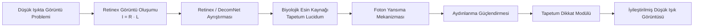
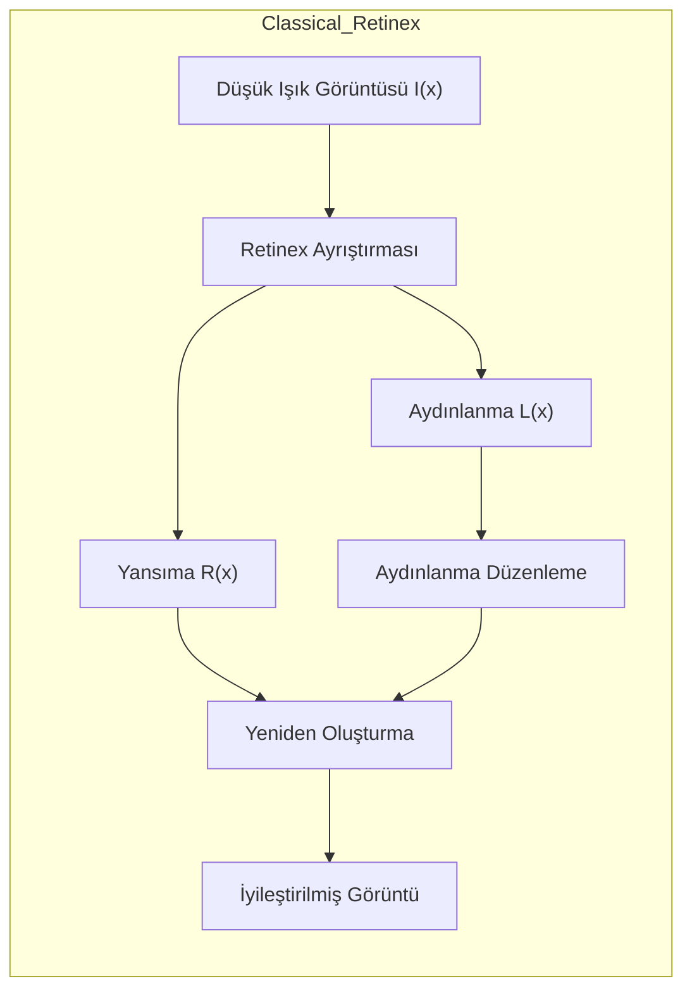
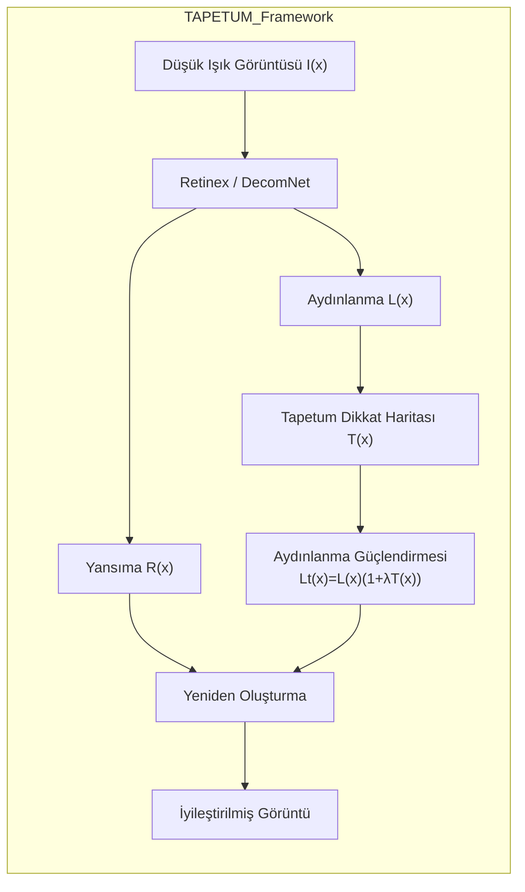
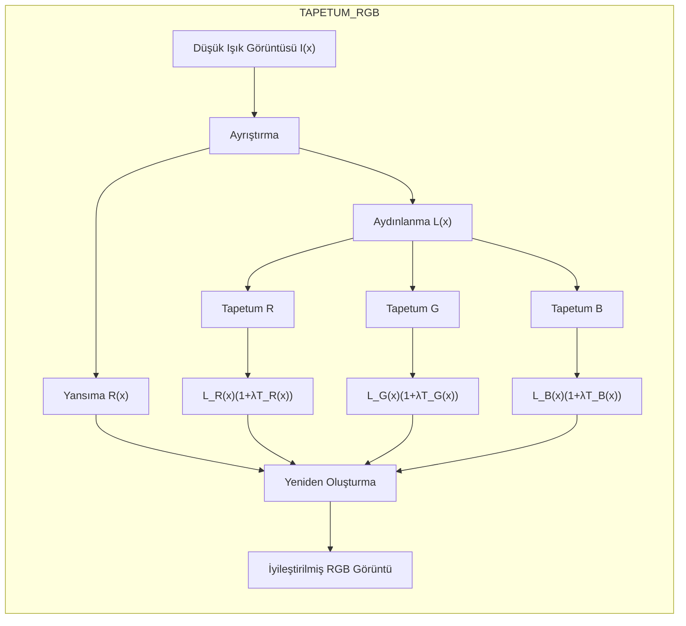
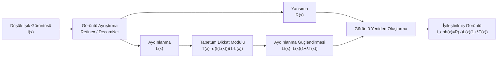
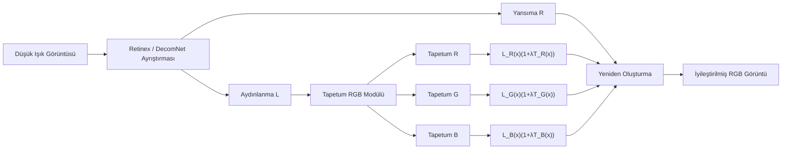
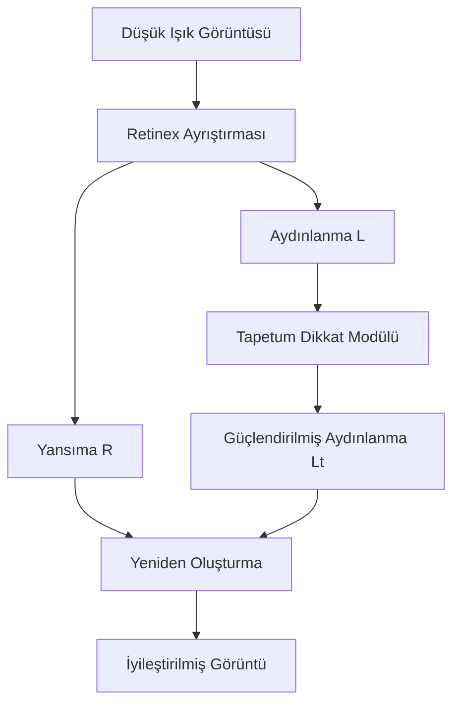
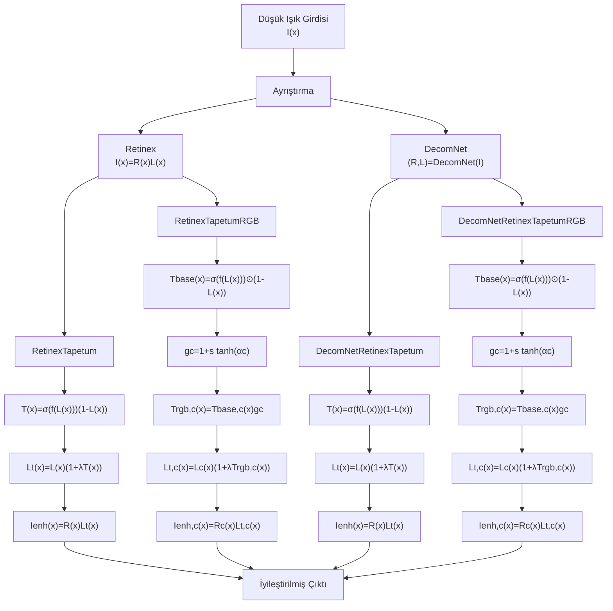
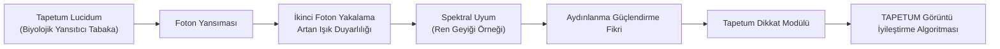
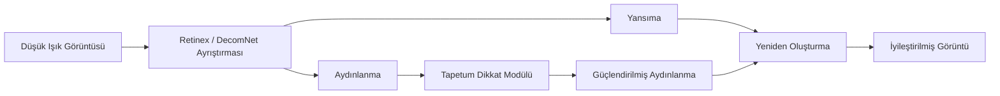

# TAPETUM: Biyolojik Esinli Düşük Işıkta Görüntü İyileştirme

[]
[]
[]
[]

TAPETUM, gececil hayvanlardaki **tapetum lucidum** foton yansıma mekanizmasından esinlenen, biyolojik temelli bir düşük ışıkta görüntü iyileştirme çatısıdır.

---

## İçindekiler

- Proje Özeti
- Projenin Temel Katkıları
- TAPETUM Mimarisi
- Yöntem Karşılaştırması
- Matematiksel Formülasyon
- Model Ailesi
- Veri Kümesi
- Görsel Sonuçlar
- Nicel Sonuçlar
- Biyolojik Esin Kaynağı
- Google Colab Hızlı Başlangıç
- Eğitim ve Değerlendirme
- İlgili Çalışmalar
- Atıf

---

## Proje Özeti

### Düşük Işıkta Görüntü İyileştirme İçin Biyolojik Esinli Bir Retinex Çatısı

<p align="center">
  
  
  
  
  
</p>

<p align="center"><b>Retinex + Tapetum Lucidum Esinli Aydınlanma Modellemesi</b></p>

TAPETUM, **Retinex ayrıştırmasını** ve **Tapetum Lucidum esinli yansıma tabanlı aydınlanma güçlendirmesini** birleştiren bir düşük ışıkta görüntü iyileştirme yaklaşımıdır. Temel amaç, karanlık sahnelerde aydınlanmayı daha etkili biçimde geri kazanırken yansıma yapısını, uzamsal detayları ve renk tutarlılığını korumaktır.

Bu depo dört ana model varyantı içermektedir:

- **RetinexTapetum**
- **RetinexTapetumRGB**
- **DecomNetRetinexTapetum**
- **DecomNetRetinexTapetumRGB**

---

## Projenin Temel Katkıları

TAPETUM çatısı, düşük ışıkta görüntü iyileştirme alanına biyolojik esinli bir bakış açısı kazandırmaktadır.



### Ana katkılar

- **Biyolojik esinli aydınlanma güçlendirmesi**  
  *Tapetum lucidum* mekanizmasının hesaplamalı bir yorumunu sunar.

- **Tapetum dikkat modülü**  
  Karanlık bölgelerde aydınlanmayı öğrenilebilir bir dikkat haritası ile güçlendirir.

- **RGB spektral Tapetum varyantı**  
  Ren geyiklerinin mevsimsel spektral uyum davranışından esinlenmiştir.

- **Retinex ve DecomNet ile uyumluluk**  
  Hem klasik ayrıştırma hem de öğrenilmiş ayrıştırma yapılarıyla birlikte kullanılabilir.

- **Güçlü nicel sonuçlar**  
  LOLv2 veri kümesi üzerinde PSNR ve SSIM metrikleri bakımından etkili sonuçlar göstermektedir.

---

## Yöntem Karşılaştırması

### Klasik Retinex



### TAPETUM



### TAPETUM RGB



---

## TAPETUM Mimarisi

### Tam mimari



### TAPETUM RGB mimarisi



---

## Yöntemin Genel Akışı

TAPETUM yaklaşımı üç temel adıma dayanır:

1. Girdi görüntüsünü **yansıma** ve **aydınlanma** bileşenlerine ayırmak
2. Aydınlanmayı **Tapetum esinli dikkat ve güçlendirme mekanizması** ile iyileştirmek
3. Son görüntüyü yeniden oluşturarak görünürlüğü artırmak



---

## Tam TAPETUM Çatısı



---

## Model Ailesi

### Model tablosu

| Model | Ayrıştırma | Tapetum | RGB Modülasyonu |
|---|---|---|---|
| RetinexTapetum | Retinex | ✓ | ✗ |
| RetinexTapetumRGB | Retinex | ✓ | ✓ |
| DecomNetRetinexTapetum | DecomNet | ✓ | ✗ |
| DecomNetRetinexTapetumRGB | DecomNet | ✓ | ✓ |

### Model açıklamaları

| Model | Açıklama |
|---|---|
| **RetinexTapetum** | Tapetum esinli aydınlanma yansıması ile Retinex ayrıştırması |
| **RetinexTapetumRGB** | Kanal-duyarlı RGB Tapetum yansıması |
| **DecomNetRetinexTapetum** | Öğrenilmiş ayrıştırma + Tapetum yansıması |
| **DecomNetRetinexTapetumRGB** | Öğrenilmiş ayrıştırma + RGB Tapetum yansıması |
| **RetinexNet** | Temel karşılaştırma modeli |

---

## Matematiksel Formülasyon

### Klasik Retinex modeli

```math
I(x) = R(x)\cdot L(x)
```

Burada:

- \(I(x)\): gözlemlenen düşük ışık görüntüsü
- \(R(x)\): yansıma bileşeni
- \(L(x)\): aydınlanma bileşeni

### Retinex-Tapetum

Tapetum dikkat haritası:

```math
T(x) = \sigma(f(L(x)))\,(1-L(x))
```

Güçlendirilmiş aydınlanma:

```math
L_t(x) = L(x)\,(1+\lambda T(x))
```

Yeniden oluşturma:

```math
I_{enh}(x) = R(x)\cdot L_t(x)
```

Kompakt form:

```math
I_{enh}(x) = R(x)\cdot L(x)\,(1+\lambda T(x))
```

### Retinex-Tapetum-RGB

Temel dikkat haritası:

```math
T_{base}(x) = \sigma(f(L(x)))\odot (1-L(x))
```

Kanal modülasyonu:

```math
g_c = 1 + s\tanh(\alpha_c), \quad c \in \{R,G,B\}
```

Kanala özgü Tapetum haritası:

```math
T^{rgb}_c(x) = T_{base,c}(x)\cdot g_c
```

Kanala özgü güçlendirilmiş aydınlanma:

```math
L_t^c(x) = L^c(x)\,(1+\lambda T^{rgb}_c(x)), \quad c \in \{R,G,B\}
```

Yeniden oluşturma:

```math
I_{enh}^c(x) = R^c(x)\cdot L_t^c(x)
```

Vektörel form:

```math
I_{enh}(x) = R(x)\odot L(x)\odot (1+\lambda T_{rgb}(x))
```

### TAPETUM temel denklemleri

```math
I_{enh}(x)=R(x)L(x)(1+\lambda T(x))
```

```math
I_{enh}(x)=R(x)\odot L(x)\odot(1+\lambda T_{rgb}(x))
```

---

## Depo Yapısı

```text
TAPETUM/
├── DecomNetRetinexTapetum/
├── DecomNetRetinexTapetumRGB/
├── LoLv2/
├── Metrics/
├── RetinexTapetumRGB/
├── datasets/
├── retinex-tapetum/
└── README.md
```

---

## Veri Kümesi

Deneyler **LOLv2 Real Captured** veri kümesi üzerinde gerçekleştirilmiştir.

### GitHub örnekleri

- `datasets/LoLv2/LOL-v2/Real_captured`
- Depo yolu: `https://github.com/muratdelen/TAPETUM/tree/main/datasets/LoLv2/LOL-v2/Real_captured`

### Google Drive veri kümesi

- **VERİ KÜMESİ İNDİRME**  
  `https://drive.google.com/drive/folders/1QO2_buG32OjDI2w3Cg1_8e5MquEww6Ix?usp=sharing`

### Veri kümesi klasör yapısı

```text
datasets/
└── LoLv2/
    └── LOL-v2/
        └── Real_captured/
            ├── Train/
            │   ├── Low/
            │   └── Normal/
            └── Test/
                ├── Low/
                └── Normal/
```

---

## Görsel Sonuçlar

### En iyi örnek nitel karşılaştırmalar

Depoda seçilmiş görsel karşılaştırmalar şu konumlarda yer almaktadır:

- GitHub: `https://github.com/muratdelen/TAPETUM/tree/main/Metrics/visuals/best_cases`
- Google Drive sonuçları: `https://drive.google.com/drive/folders/1dTq0xWTz0xJL2ngVaFqajoVVtfNE2VgY?usp=sharing`

Bu klasörlerde aşağıdaki güçlü örnekler bulunmaktadır:

- `01_00755.png`
- `02_00756.png`
- `03_00744.png`
- `04_00751.png`
- `05_00720.png`
- `06_00741.png`
- `07_00721.png`
- `08_00748.png`
- `09_00747.png`
- `10_00750.png`

### Örnek görseller

<p align="center">
  
</p>

<p align="center">
  
</p>

<p align="center">
  
</p>

### Model çıktı klasörleri

#### GitHub sonuç klasörleri

- RetinexNet: `https://github.com/muratdelen/TAPETUM/tree/main/LoLv2/RetinexNet/results/Test`
- RetinexTapetum: `https://github.com/muratdelen/TAPETUM/tree/main/LoLv2/retinex-tapetum/results/Test`
- RetinexTapetumRGB: `https://github.com/muratdelen/TAPETUM/tree/main/LoLv2/RetinexTapetumRGB/results/Test`
- DecomNetRetinexTapetum: `https://github.com/muratdelen/TAPETUM/tree/main/LoLv2/DecomNetRetinexTapetum/results/Test`
- DecomNetRetinexTapetumRGB: `https://github.com/muratdelen/TAPETUM/tree/main/LoLv2/DecomNetRetinexTapetumRGB/results/Test`

#### Google Drive kaynakları

- **TAPETUM İNDİRME**  
  `https://drive.google.com/drive/folders/1EtT9abcdGIWMrzZ2zUGHB0A_gg7LMM8J?usp=sharing`
- **RETINEXNET İNDİRME**  
  `https://drive.google.com/drive/folders/1CKqjhcsQ5Fs8Btkn4jFoFXqCy9gZlh35?usp=sharing`
- **RESULT LOLV2 İNDİRME**  
  `https://drive.google.com/drive/folders/1dTq0xWTz0xJL2ngVaFqajoVVtfNE2VgY?usp=sharing`

### Nitel gözlemler

- DecomNet tabanlı TAPETUM varyantları, daha karanlık bölgeleri daha etkili biçimde geri kazanmaktadır.
- RGB varyantı çoğu durumda renk dengesi ve spektral tutarlılığı iyileştirmektedir.
- RetinexTapetum ve RetinexTapetumRGB, yöntem fikrini korusa da nicel performansları DecomNet tabanlı modellerin gerisinde kalmaktadır.
- DecomNetRetinexTapetumRGB, parlaklık, detay ve renk doğruluğu açısından genellikle en dengeli görsel sonucu üretmektedir.

---

## Görsel Karşılaştırma

Aşağıdaki şekil, **LOLv2 Real Captured** veri kümesi üzerindeki nitel karşılaştırma sonuçlarını göstermektedir.

| Düşük Işık Girdisi | Ground Truth | RetinexNet | RetinexTapetum | TapetumRGB | DecomNetTapetum | DecomNetTapetumRGB |
|---|---|---|---|---|---|---|
|  |  |  |  |  |  |  |

### Şekil açıklaması

Soldan sağa:

1. **Düşük Işık Girdisi** – LOLv2 veri kümesinden orijinal düşük ışık görüntüsü  
2. **Ground Truth** – Referans normal ışık görüntüsü  
3. **RetinexNet** – Temel Retinex modeli  
4. **RetinexTapetum** – Tapetum foton yansıma modellemesi ile güçlendirilmiş Retinex  
5. **TapetumRGB** – Kanal-duyarlı Tapetum yansıma mekanizması  
6. **DecomNetTapetum** – Tapetum iyileştirmesi ile öğrenilmiş ayrıştırma  
7. **DecomNetTapetumRGB** – RGB uyarlamalı Tapetum dikkati içeren tam model

---

## Nicel Sonuçlar

Aşağıdaki ortalama sonuçlar depo içindeki metrik tablolarından derlenmiştir.

### Özet metrikler

| Model | Eşleşen Dosya | PSNR ↑ | SSIM ↑ | MAE ↓ | MSE ↓ | RMSE ↓ | LPIPS ↓ |
|---|---:|---:|---:|---:|---:|---:|---:|
| **DecomNetRetinexTapetumRGB** | 100 | **19.2938** | 0.7632 | 24.6575 | 1009.2340 | 29.8147 | 0.3983 |
| **DecomNetRetinexTapetum** | 100 | 19.2473 | **0.7734** | 24.7627 | 997.9153 | 29.7785 | 0.3669 |
| RetinexNet | 100 | 15.9504 | 0.6524 | 0.1396 | 0.0284 | 0.1639 | N/A |
| RetinexTapetumRGB | 100 | 12.4179 | 0.4208 | 62.0526 | 4733.0982 | 65.0186 | **0.3411** |
| RetinexTapetum | 100 | 11.9131 | 0.3942 | 64.8876 | 5118.1268 | 68.1592 | 0.3541 |

### Sıralama özeti

| Model | Toplam Sıra | PSNR Sırası | SSIM Sırası | MAE Sırası | MSE Sırası | RMSE Sırası | LPIPS Sırası |
|---|---:|---:|---:|---:|---:|---:|---:|
| **DecomNetRetinexTapetum** | **13.0** | 2 | 1 | 3 | 2 | 2 | 3 |
| **RetinexNet** | **13.0** | 3 | 3 | 1 | 1 | 1 | 4 |
| DecomNetRetinexTapetumRGB | 15.0 | 1 | 2 | 2 | 3 | 3 | 4 |
| RetinexTapetumRGB | 21.0 | 4 | 4 | 4 | 4 | 4 | 1 |
| RetinexTapetum | 27.0 | 5 | 5 | 5 | 5 | 5 | 2 |

### Görüntü başına en iyi sonuç sayıları

| Model | En İyi PSNR | En İyi SSIM | En İyi MAE | En İyi MSE | En İyi RMSE | En İyi LPIPS |
|---|---:|---:|---:|---:|---:|---:|
| **DecomNetRetinexTapetum** | **39** | **69** | 0 | 0 | 0 | 44 |
| DecomNetRetinexTapetumRGB | 38 | 19 | 0 | 0 | 0 | 4 |
| RetinexNet | 15 | 3 | **100** | **100** | **100** | 0 |
| RetinexTapetumRGB | 8 | 9 | 0 | 0 | 0 | **52** |
| RetinexTapetum | 0 | 0 | 0 | 0 | 0 | 0 |

### Yorum

- **DecomNetRetinexTapetumRGB**, en yüksek ortalama **PSNR** değerini elde etmektedir.
- **DecomNetRetinexTapetum**, en yüksek ortalama **SSIM** değerini elde etmektedir.
- TAPETUM ailesi içinde en güçlü genel performans **DecomNet tabanlı varyantlardan** gelmektedir.
- **RetinexNet** için MAE, MSE ve RMSE değerleri diğer modellere göre farklı bir ölçekten geliyor olabilir; bu nedenle dikkatli yorumlanmalıdır.

### Benchmark karşılaştırması

| Yöntem | PSNR ↑ | SSIM ↑ | Tür |
|---|---:|---:|---|
| RetinexNet | 15.95 | 0.652 | Retinex tabanlı derin model |
| RetinexTapetum | 11.91 | 0.394 | Biyolojik esinli Retinex |
| RetinexTapetumRGB | 12.42 | 0.421 | Kanal-duyarlı biyolojik esinli Retinex |
| DecomNetRetinexTapetum | 19.25 | **0.773** | Öğrenilmiş Retinex + Tapetum |
| **DecomNetRetinexTapetumRGB (TAPETUM)** | **19.29** | 0.763 | Tam TAPETUM modeli |

---

## Biyolojik Esin Kaynağı

### Biyolojik görme → TAPETUM algoritması

TAPETUM çatısı, gececil hayvanlarda bulunan **tapetum lucidum** adlı yansıtıcı tabakadan esinlenmiştir.



Birçok gececil hayvanda gelen ışık, tapetum lucidum sayesinde retinaya geri yansıtılır. Böylece ilk geçişte emilemeyen fotonların ikinci kez yakalanması sağlanır. Bu mekanizma düşük ışık koşullarında görünürlüğü artırır.

### Basitleştirilmiş biyolojik model

```math
I_{effective} = I + rI
```

Burada:

- \(I\): gelen ışık
- \(rI\): tapetum tarafından geri yansıtılan ışık bileşeni

Bu süreç parlaklığı artırabilir; ancak saçılmaya bağlı olarak yapısal hassasiyette küçük kayıplar oluşturabilir.

### TAPETUM algoritmasına yansıması

1. **Retinex ayrıştırması** ile yansıma ve aydınlanma ayrılır.
2. **Tapetum dikkat modülü** ile özellikle karanlık bölgelerde aydınlanma güçlendirilir.
3. **Yeniden oluşturma** ile görünürlüğü artırılmış nihai çıktı üretilir.



---

## Metrik Farklarının Biyolojik Yorumu

**DecomNetRetinexTapetumRGB** ile **DecomNetRetinexTapetum** arasındaki performans farkı, biyolojik sistemlerde görülen parlaklık-yapı ödünleşimi ile açıklanabilir.

### Ren geyiği spektral uyumu

Bazı hayvanlar, özellikle **ren geyikleri**, tapetum lucidum’un yansıtıcı özelliklerinde mevsimsel değişim gösterir. Kış aylarında daha kısa dalga boylarına, özellikle mavi bölgeye daha duyarlı hale gelirler. Bu durum düşük ışıkta daha fazla foton yakalanmasını sağlayabilir.

### TAPETUM modellerine karşılığı

#### DecomNetRetinexTapetumRGB

RGB varyantı her renk kanalını bağımsız biçimde güçlendirir:

```math
L_t^c(x) = L^c(x)(1+\lambda T^{rgb}_c(x))
```

Bu yaklaşım:

- piksel düzeyinde parlaklık geri kazanımını artırabilir
- daha yüksek **PSNR** üretebilir
- ancak kanal bazlı modülasyon nedeniyle yapısal tutarlılıkta küçük düşüşler oluşturabilir

#### DecomNetRetinexTapetum

Standart varyant tek bir aydınlanma haritası kullanır:

```math
L_t(x) = L(x)(1+\lambda T(x))
```

Bu yaklaşım:

- daha kararlı uzamsal yapı üretir
- kenar ve doku korunumunu artırabilir
- daha yüksek **SSIM** ile sonuçlanabilir

### Özet

- **RGB Tapetum** → daha güçlü parlaklık geri kazanımı → daha yüksek PSNR
- **Standart Tapetum** → daha güçlü yapısal koruma → daha yüksek SSIM

Bu sonuç, biyolojik sistemlerde görülen ışık duyarlılığı ile yapısal doğruluk arasındaki ödünleşim ile uyumludur.

---

## Google Colab Hızlı Başlangıç

[](https://colab.research.google.com/github/muratdelen/TAPETUM/blob/main/TAPETUM.ipynb)

Projeyi çalıştırmanın en kolay yolu sağlanan Colab not defteridir.

- Not defteri: `TAPETUM.ipynb`
- GitHub Colab bağlantısı: `[GitHub’da TAPETUM.ipynb Aç](https://github.com/muratdelen/TAPETUM/blob/main/TAPETUM.ipynb)`

### Colab iş akışı

Not defteri aşağıdaki aşamaları içermektedir:

1. **Drive’dan Colab’a kopyalama**  
   `/content/drive/MyDrive/TAPETUM` → `/content/TAPETUM`

2. **Tüm TAPETUM modellerini çalıştırma**

   ```bash
   python /content/TAPETUM/run_all_tapetum_models_colab.py
   ```

3. **Tüm TAPETUM modellerini eğitme**
   - `RetinexTapetum`
   - `RetinexTapetumRGB`
   - `DecomNetRetinexTapetum`
   - `DecomNetRetinexTapetumRGB`

4. **Tüm TAPETUM modellerini test etme**

5. **Tüm modelleri değerlendirme**

   ```bash
   /content/TAPETUM/Metrics/evaluate_all_models_updated.py
   ```

6. **Sonuçları Google Drive’a geri senkronlama**

7. **İsteğe bağlı RetinexNet taban çizgisi**
   - `RETINEXNET TRAIN`
   - `RETINEXNET TEST`

### Önerilen çalıştırma sırası

1. **TAPETUM Driverdan yükle**
2. **tüm kodu çalıştır**
3. **TRAIN ALL TAPETUM MODELS**
4. **TEST ALL TAPETUM MODELS**
5. **evaluate_all_models_updated.py çalıştır**
6. **TAPETUM → DRIVE SENKRON KAYIT**

Temel karşılaştırmayı da dahil etmek istersen:

7. **RETINEXNET TRAIN**
8. **RETINEXNET TEST**

### Gerekli Drive klasör yapısı

```text
MyDrive/
└── TAPETUM/
```

Colab içinde beklenen çalışma dizini:

```text
/content/TAPETUM
```

### Kısa README talimatı

```markdown
Projeyi `TAPETUM.ipynb` kullanarak Google Colab üzerinde çalıştırın.

Önerilen sıra:
1. TAPETUM klasörünü Drive’dan `/content/TAPETUM` konumuna kopyalayın
2. Tüm TAPETUM modellerini çalıştırın
3. Tüm modelleri eğitin
4. Tüm modelleri test edin
5. Metrikleri değerlendirin
6. Sonuçları tekrar Drive’a senkronlayın
```

---

## Eğitim ve Değerlendirme

İş akışı genel olarak aşağıdaki komutlara göre düzenlenebilir:

```bash
python train.py
python test.py
python evaluate.py
```

Depodaki değerlendirme kaynakları:

- Karşılaştırma logları: `https://github.com/muratdelen/TAPETUM/tree/main/comparison_results`
- Sonuç görüntüleri: `https://github.com/muratdelen/TAPETUM/tree/main/LoLv2`
- Metrikler: `https://github.com/muratdelen/TAPETUM/tree/main/Metrics`

---

## İndirmeler

### GitHub Deposu

- `https://github.com/muratdelen/TAPETUM.git`

### Google Drive

- **TAPETUM İNDİRME**  
  `https://drive.google.com/drive/folders/1EtT9abcdGIWMrzZ2zUGHB0A_gg7LMM8J?usp=sharing`

- **VERİ KÜMESİ İNDİRME**  
  `https://drive.google.com/drive/folders/1QO2_buG32OjDI2w3Cg1_8e5MquEww6Ix?usp=sharing`

- **RETINEXNET İNDİRME**  
  `https://drive.google.com/drive/folders/1CKqjhcsQ5Fs8Btkn4jFoFXqCy9gZlh35?usp=sharing`

- **RESULT LOLV2 İNDİRME**  
  `https://drive.google.com/drive/folders/1dTq0xWTz0xJL2ngVaFqajoVVtfNE2VgY?usp=sharing`

- **METRICS İNDİRME**  
  `https://drive.google.com/drive/folders/13XOBg-1gWTgSrbhDkDteI1pIqVIdjCfE?usp=sharing`

---

## Atıf

Bu depoyu çalışmanızda kullanırsanız aşağıdaki biçimde atıf yapabilirsiniz:

```bibtex
@article{delen2026tapetum,
  title={Tapetum-Retinex: A Bio-Inspired Retinex Framework for Low-Light Image Enhancement},
  author={Delen, Murat},
  year={2026}
}
```

---

## Yazar

**Murat Delen**  
Bilgisayar Mühendisliği  
Harran Üniversitesi  
GitHub: `https://github.com/muratdelen`

---

## Lisans

Bu depo **araştırma ve akademik amaçlarla** sunulmaktadır.

---

## İlgili Çalışmalar

Düşük ışıkta görüntü iyileştirme (LLIE), Retinex tabanlı, öğrenme tabanlı ve eğri tabanlı yöntemlerle geniş biçimde ele alınmıştır.

### Retinex tabanlı derin modeller

- **RetinexNet** – Yansıma ve aydınlanmayı CNN tabanlı biçimde ayıran öncü derin Retinex modeli
- **KinD / KinD++** – Aydınlanma ayarlama ve yansıma geri kazanımı için modüler yapı sunar
- **RUAS** – Hafif ve denetimsiz düşük ışık iyileştirme mimarisi

Bu modeller genellikle şu formülasyonu temel alır:

```math
I(x) = R(x) \cdot L(x)
```

### Eğri tabanlı yöntemler

- **Zero-DCE / Zero-DCE++** – Eşlenik denetime ihtiyaç duymadan piksel bazlı ışık eğrileri öğrenir

Bu yöntemler hızlı ve verimli olsa da ağır aydınlanma bozulmalarında sınırlı kalabilir.

### Biyolojik esinli iyileştirme

Son yıllarda biyolojik görme sistemlerinden ilham alan yaklaşımlar artmaktadır. TAPETUM, **tapetum lucidum foton yansıma mekanizmasını** hesaplamalı bir aydınlanma güçlendirme modülüne dönüştürerek bu doğrultuda katkı sunmaktadır.

Klasik Retinex tabanlı yöntemlere kıyasla TAPETUM şunları eklemektedir:

- foton yansımasına dayalı aydınlanma güçlendirmesi
- RGB kanal-duyarlı spektral iyileştirme
- DecomNet ile öğrenilmiş ayrıştırma uyumluluğu

Bu sayede TAPETUM, **biyolojik esin ile derin Retinex modellemesini** bir araya getirmektedir.

---

## Retinex’in Biyolojik Arka Planı

### İnsan görmesi ve Retinex teorisi

Retinex teorisi, **Edwin H. Land ve John J. McCann (1971)** tarafından insan görsel sisteminin değişen aydınlanma altında renkleri nasıl algıladığını açıklamak için önerilmiştir. İnsan görmesi, mutlak parlaklıktan ziyade sahne içindeki **uzamsal karşılaştırmalara** dayanır.

İnsan görmesi üç bağımsız koni kanalı ile çalışır:

- **L**: uzun dalga boyu
- **M**: orta dalga boyu
- **S**: kısa dalga boyu

Retinex modelleri bu algısal yapıyı şu ayrıştırma ile temsil eder:

```math
I(x) = R(x)L(x)
```

Burada:

- \(I(x)\): gözlemlenen görüntü
- \(R(x)\): nesnenin içsel yansıması
- \(L(x)\): aydınlanma koşulu

### Uzamsal karşılaştırma mekanizması

Erken nörofizyolojik çalışmalar, görsel algının **göreli uzamsal farklılıklara** dayandığını göstermiştir:

- **Kuffler (1953)** – merkez-çevre reseptif alanlar
- **Barlow** – uzamsal karşılaştırma mekanizmaları
- **Hubel & Wiesel** – görsel kortekste özellik algılama

Retinex algoritmaları da bu mantığı yerel kontrast ve aydınlanma ayrıştırması üzerinden taklit eder.

### Mondrian deneyi

Land’in **Color Mondrian** deneyleri, aynı fiziksel ışık yoğunluğuna sahip yüzeylerin çevresel bağlama göre farklı algılanabildiğini göstermiştir. Bu durum, renk algısının mutlak değil göreli ve uzamsal olduğunu doğrular.

### Düşük ışık iyileştirme ile ilişkisi

Düşük ışıkta görüntü iyileştirme, aydınlanmayı geri kazanırken içsel yansımayı koruma problemi olarak düşünülebilir. Retinex tabanlı modeller bu nedenle LLIE alanında güçlü teorik temele sahiptir.

### TAPETUM ile bağlantı

TAPETUM, klasik Retinex yaklaşımını şu biçimde genişletir:

```math
L_t(x) = L(x)(1+\lambda T(x))
```

Burada:

- \(T(x)\): Tapetum dikkat haritası
- \(\lambda\): güçlendirme katsayısı

### RGB spektral uyum

Ren geyikleri gibi bazı hayvanların tapetum yapısında mevsimsel spektral değişimler görülür. Bu biyolojik gözlemden esinlenerek **Retinex-Tapetum RGB**, kanal bazlı aydınlanma güçlendirmesi uygular:

```math
L_c(x) = L_c(x)(1+\lambda T_c(x))
```

Bu yapı daha yüksek parlaklık sağlayabilir; ancak yapısal benzerlikte kısmi ödünleşim oluşturabilir.
