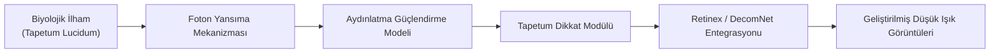
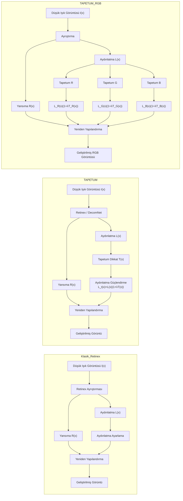
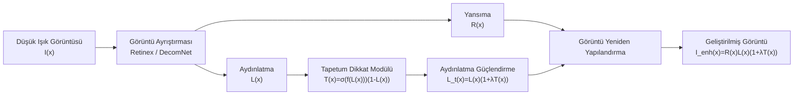
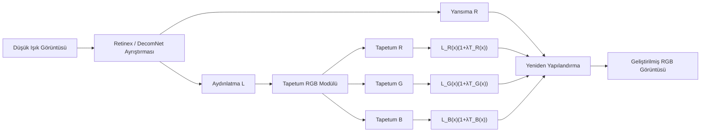
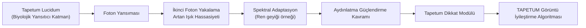

# TAPETUM: Biyolojik İlhamlı Düşük Işık Görüntü İyileştirme

[](https://www.python.org/)
[](https://pytorch.org/)
[](https://github.com/muratdelen/TAPETUM/tree/main/datasets/LoLv2/LOL-v2/Real_captured)
[](https://colab.research.google.com/github/muratdelen/TAPETUM/blob/main/TAPETUM.ipynb)

Gece hayvanlarında bulunan **tapetum lucidum** foton yansıma mekanizmalarından esinlenen, **Retinex tabanlı** düşük ışık görüntü iyileştirme çerçevesi.

---

## İçindekiler

- [Proje Öne Çıkanları](#proje-öne-çıkanları)
- [Yöntem Karşılaştırması](#yöntem-karşılaştırması-retinex-vs-tapetum-vs-tapetum-rgb)
- [TAPETUM Mimari](#tapetum-mimari)
- [Genel Bakış](#genel-bakış)
- [Matematiksel Formülasyon](#matematiksel-formülasyon)
- [Görsel Karşılaştırma Yapısı](#görsel-karşılaştırma-yapısı)
- [Veri Kümesi](#veri-kümesi)
- [Model Varyantları](#model-varyantları)
- [Görsel Sonuçlar](#görsel-sonuçlar)
- [Nicel Sonuçlar](#nicel-sonuçlar)
- [Biyolojik İlham](#biyolojik-ilham)
- [Metrik Farklılıkların Biyolojik Yorumu](#metrik-farklılıkların-biyolojik-yorumu)
- [Google Colab Hızlı Başlangıç](#google-colab-hızlı-başlangıç)
- [Eğitim ve Değerlendirme](#eğitim-ve-değerlendirme)
- [İlgili Çalışmalar](#ilgili-çalışmalar-düşük-ışıkta-görüntü-iyileştirme)
- [Alıntı](#alıntı)

---

## Proje Öne Çıkanları

TAPETUM çerçevesi, düşük ışıkta görüntü iyileştirme için biyolojik ilhamlı bir yaklaşım sunar.



### Başlıca Katkılar

- **Biyolojik İlhamlı Aydınlatma Güçlendirme**  
  *Tapetum lucidum* mekanizmasının hesaplamalı bir yorumunu sunar.

- **Tapetum Dikkat Modülü**  
  Öğrenilebilir dikkat mekanizmasıyla aydınlatmayı güçlendirir.

- **RGB Spektral Tapetum Varyantı**  
  Ren geyiğinin mevsimsel spektral adaptasyonundan esinlenmiştir.

- **Retinex Çerçeveleriyle Uyumluluk**  
  Hem klasik Retinex ayrıştırması hem de öğrenilmiş ayrıştırma ağlarıyla çalışır.

- **Güçlü Nicel Performans**  
  LOLv2 veri kümesinde PSNR ve SSIM açısından rekabetçi sonuçlar üretir.

---

## Yöntem Karşılaştırması: Retinex vs TAPETUM vs TAPETUM RGB



---

## TAPETUM Mimari

### TAPETUM Tam Mimari



### TAPETUM RGB Mimari



### Model Ailesine Genel Bakış

| Model | Ayrıştırma | Tapetum | RGB Modülasyonu |
|---|---|---|---|
| RetinexTapetum | Retinex | ✓ | ✗ |
| RetinexTapetumRGB | Retinex | ✓ | ✓ |
| DecomNetRetinexTapetum | DecomNet | ✓ | ✗ |
| DecomNetRetinexTapetumRGB | DecomNet | ✓ | ✓ |

---

## Genel Bakış

Gece aktif olan birçok hayvanın, gelen fotonları retinaya geri yansıtan ve düşük ışık koşullarında görmeyi iyileştiren **tapetum lucidum** adlı yansıtıcı bir göz tabakası vardır. TAPETUM, bu biyolojik fikri düşük ışıkta görüntü iyileştirme için hesaplamalı bir çerçeveye dönüştürür.

Temel akış:

1. Giriş görüntüsünü **yansıma** ve **aydınlatma** bileşenlerine ayır.
2. **Tapetum ilhamlı dikkat modülü** ile aydınlatmayı güçlendir.
3. Son geliştirilmiş görüntüyü yeniden oluştur.

---

## Matematiksel Formülasyon

### Klasik Retinex Modeli

```math
I(x) = R(x)\cdot L(x)
```

Burada:

- \(I(x)\): gözlemlenen düşük ışık görüntüsü
- \(R(x)\): yansıma bileşeni
- \(L(x)\): aydınlatma bileşeni

### Retinex-Tapetum

Tapetum dikkat haritası:

```math
T(x) = \sigma(f(L(x)))\,(1-L(x))
```

Geliştirilmiş aydınlatma:

```math
L_t(x) = L(x)\,(1+\lambda T(x))
```

Yeniden yapılandırma:

```math
I_{enh}(x) = R(x)\cdot L_t(x)
```

Kompakt form:

```math
I_{enh}(x) = R(x)\cdot L(x)\,(1+\lambda T(x))
```

### Retinex-Tapetum-RGB

Temel dikkat:

```math
T_{base}(x) = \sigma(f(L(x)))\odot (1-L(x))
```

Kanal modülasyonu:

```math
g_c = 1 + s	anh(lpha_c), \quad c \in \{R,G,B\}
```

Kanala özgü Tapetum haritası:

```math
T^{rgb}_c(x) = T_{base,c}(x)\cdot g_c
```

Kanal başına geliştirilmiş aydınlatma:

```math
L_t^c(x) = L^c(x)\,(1+\lambda T^{rgb}_c(x)), \quad c \in \{R,G,B\}
```

Vektör biçimi:

```math
I_{enh}(x) = R(x)\odot L(x)\odot (1+\lambda T_{rgb}(x))
```

---

## Görsel Karşılaştırma Yapısı

Bu bölümde LOLv2 Real-Captured veri seti üzerinde farklı yöntemlerin görsel karşılaştırması gösterilmektedir. İlk sütunda düşük ışık görüntüsü, ikinci sütunda gerçek (normal ışık) görüntü ve diğer sütunlarda farklı Retinex tabanlı yöntemlerin sonuçları yer almaktadır.

| Düşük Işık Girişi | Gerçek Görüntü | RetinexNet | RetinexTapetum | TapetumRGB | DecomNetTapetum | DecomNetTapetumRGB |
|---|---|---|---|---|---|---|
|  |  |  |  |  |  |  |

---

## Veri Kümesi

Deneyler **LOLv2 Real-Captured** veri kümesi üzerinde gerçekleştirilmiştir.

### GitHub
- [datasets/LoLv2/LOL-v2/Real_captured](https://github.com/muratdelen/TAPETUM/tree/main/datasets/LoLv2/LOL-v2/Real_captured)

### Google Drive
- [VERİ KÜMESİ İNDİRME](https://drive.google.com/drive/folders/1QO2_buG32OjDI2w3Cg1_8e5MquEww6Ix?usp=sharing)

Veri kümesi düzeni:

```text
datasets/
└── LoLv2/
    └── LOL-v2/
        └── Real_captured/
            ├── Train/
            │   ├── Low/
            │   └── Normal/
            └── Test/
                ├── Low/
                └── Normal/
```

---

## Model Varyantları

| Model | Açıklama |
|---|---|
| **RetinexTapetum** | Tapetum ilhamlı aydınlatma güçlendirmesiyle Retinex ayrıştırması |
| **RetinexTapetumRGB** | Kanal duyarlı RGB Tapetum yansıması |
| **DecomNetRetinexTapetum** | Öğrenilmiş ayrıştırma + Tapetum yansıması |
| **DecomNetRetinexTapetumRGB** | Öğrenilmiş ayrıştırma + RGB Tapetum yansıması |
| **RetinexNet** | Temel karşılaştırma modeli |

---

## Görsel Sonuçlar

### En iyi durum örnekleri

- [GitHub best_cases klasörü](https://github.com/muratdelen/TAPETUM/tree/main/Metrics/visuals/best_cases)
- [Google Drive sonuçları](https://drive.google.com/drive/folders/1dTq0xWTz0xJL2ngVaFqajoVVtfNE2VgY?usp=sharing)

Örnek görseller:

<p align="center">
  
</p>

<p align="center">
  
</p>

<p align="center">
  
</p>

### Nitel gözlemler

- DecomNet tabanlı TAPETUM varyantları daha koyu bölgeleri daha etkili biçimde kurtarır.
- RGB sürümü genellikle renk dengesini ve spektral tutarlılığı iyileştirir.
- DecomNetRetinexTapetumRGB çoğu durumda en dengeli görsel sonucu üretir.

---

## Nicel Sonuçlar

### Özet ölçümler

| Model | Eşleşen Dosyalar | PSNR ↑ | SSIM ↑ | MAE ↓ | MSE ↓ | RMSE ↓ | LPIPS ↓ |
|---|---:|---:|---:|---:|---:|---:|---:|
| **DecomNetRetinexTapetumRGB** | 100 | **19.2938** | 0.7632 | 24.6575 | 1009.2340 | 29.8147 | 0.3983 |
| **DecomNetRetinexTapetum** | 100 | 19.2473 | **0.7734** | 24.7627 | 997.9153 | 29.7785 | 0.3669 |
| RetinexNet | 100 | 15.9504 | 0.6524 | 0.1396 | 0.0284 | 0.1639 | N/A |
| RetinexTapetumRGB | 100 | 12.4179 | 0.4208 | 62.0526 | 4733.0982 | 65.0186 | 0.3411 |
| RetinexTapetum | 100 | 11.9131 | 0.3942 | 64.8876 | 5118.1268 | 68.1592 | 0.3541 |

### Yorum

- **DecomNetRetinexTapetumRGB**, en yüksek ortalama **PSNR** değerine sahiptir.
- **DecomNetRetinexTapetum**, en yüksek ortalama **SSIM** değerine sahiptir.
- TAPETUM ailesi içinde genel olarak en güçlü iki varyant **DecomNet tabanlı modellerdir**.

---

## Biyolojik İlham

### Biyolojik Görme → TAPETUM Algoritması



TAPETUM çerçevesi, gece aktif hayvanların gözlerinde bulunan **tapetum lucidum** yapısından esinlenmiştir. Bu yapı gelen ışığı retina üzerinden geri yansıtır ve düşük ışık altında foton yakalama oranını artırır.

Basitleştirilmiş model:

```math
I_{effective} = I + rI
```

Burada \(rI\), tapetum tabakasından yansıyan bileşeni ifade eder.

---

## Metrik Farklılıkların Biyolojik Yorumu

**DecomNetRetinexTapetumRGB** ile **DecomNetRetinexTapetum** arasındaki fark, biyolojik ilham üzerinden yorumlanabilir.

### Ren geyiği spektral adaptasyonu

Kış aylarında ren geyiğinin tapetum lucidum yapısı daha fazla **mavi dalga boyu** yansıtarak düşük ışıkta duyarlılığı artırır. Ancak bu durum saçılmayı da artırabilir.

### Metrik yorumu

| Model | PSNR | SSIM |
|---|---|---|
| DecomNetRetinexTapetumRGB | Daha yüksek | Biraz daha düşük |
| DecomNetRetinexTapetum | Biraz daha düşük | Daha yüksek |

RGB varyantı:

```math
L_t^c(x) = L^c(x)(1+\lambda T^{rgb}_c(x))
```

Standart varyant:

```math
L_t(x) = L(x)(1+\lambda T(x))
```

Bu nedenle:

- **RGB Tapetum** → daha güçlü parlaklık geri kazanımı → daha yüksek PSNR
- **Standart Tapetum** → daha kararlı yapısal koruma → daha yüksek SSIM

---

## Google Colab Hızlı Başlangıç

[](https://colab.research.google.com/github/muratdelen/TAPETUM/blob/main/TAPETUM.ipynb)

Projeyi çalıştırmanın en kolay yolu, sağlanan Colab not defterini kullanmaktır:

- [GitHub'da TAPETUM.ipynb](https://github.com/muratdelen/TAPETUM/blob/main/TAPETUM.ipynb)

### Colab iş akışı

1. Google Drive bağlanır ve proje klasörü `/content/TAPETUM` altına kopyalanır.
2. Tüm TAPETUM modelleri çalıştırılır.
3. Eğitim süreci başlatılır.
4. Test çıktıları üretilir.
5. Metrikler hesaplanır.
6. Sonuçlar Drive'a geri senkronize edilir.

### Çalıştırma sırası

1. **TAPETUM Driverdan yükle**
2. **tüm kodu çalıştır**
3. **TRAIN ALL TAPETUM MODELS**
4. **TEST ALL TAPETUM MODELS**
5. **evaluate_all_models_updated.py**
6. **TAPETUM → DRIVE SENKRON KAYIT**

---

## Eğitim ve Değerlendirme

```bash
python train.py
python test.py
python evaluate.py
```

Kaynaklar:

- [Karşılaştırma logları](https://github.com/muratdelen/TAPETUM/tree/main/comparison_results)
- [Sonuç görselleri](https://github.com/muratdelen/TAPETUM/tree/main/LoLv2)
- [Metrikler](https://github.com/muratdelen/TAPETUM/tree/main/Metrics)

---

## İlgili Çalışmalar (Düşük Işıkta Görüntü İyileştirme)

### Retinex tabanlı derin modeller

- **RetinexNet** – CNN ile yansıma ve aydınlatmayı ayıran öncü model
- **KinD / KinD++** – aydınlatma ayarlama ve yansıma geri yükleme modülleri
- **RUAS** – hafif, denetimsiz düşük ışık iyileştirme mimarisi

### Eğri tabanlı geliştirme

- **Zero-DCE / Zero-DCE++** – denetimsiz piksel tabanlı ışık eğrisi tahmini

### Biyolojik ilhamlı geliştirme

TAPETUM, **tapetum lucidum** foton yansıma mekanizmasını modelleyerek klasik Retinex yöntemlerini biyolojik ilhamla genişletir.

---

## İndirmeler

### GitHub
- [TAPETUM deposu](https://github.com/muratdelen/TAPETUM.git)

### Google Drive
- [TAPETUM İNDİRME](https://drive.google.com/drive/folders/1EtT9abcdGIWMrzZ2zUGHB0A_gg7LMM8J?usp=sharing)
- [VERİ KÜMESİ İNDİRME](https://drive.google.com/drive/folders/1QO2_buG32OjDI2w3Cg1_8e5MquEww6Ix?usp=sharing)
- [RETINEXNET İNDİRME](https://drive.google.com/drive/folders/1CKqjhcsQ5Fs8Btkn4jFoFXqCy9gZlh35?usp=sharing)
- [RESULT LOLV2 İNDİRME](https://drive.google.com/drive/folders/1dTq0xWTz0xJL2ngVaFqajoVVtfNE2VgY?usp=sharing)
- [METRICS İNDİRME](https://drive.google.com/drive/folders/13XOBg-1gWTgSrbhDkDteI1pIqVIdjCfE?usp=sharing)

---

## Alıntı

Bu depoyu araştırmanızda kullanıyorsanız şu şekilde atıf yapabilirsiniz:

```bibtex
@article{delen2026tapetum,
  title={Tapetum-Retinex: Düşük Işıkta Görüntü İyileştirme için Biyolojik Esinli Retinex Çerçevesi},
  author={Delen, Murat},
  year={2026}
}
```

---

## Yazar

**Murat Delen**  
Bilgisayar Mühendisliği  
Harran Üniversitesi  
GitHub: [muratdelen](https://github.com/muratdelen)

---

## Lisans

Bu depo **araştırma ve akademik amaçlar** için sunulmuştur.
